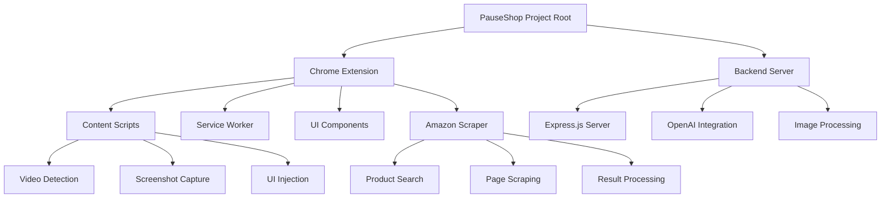
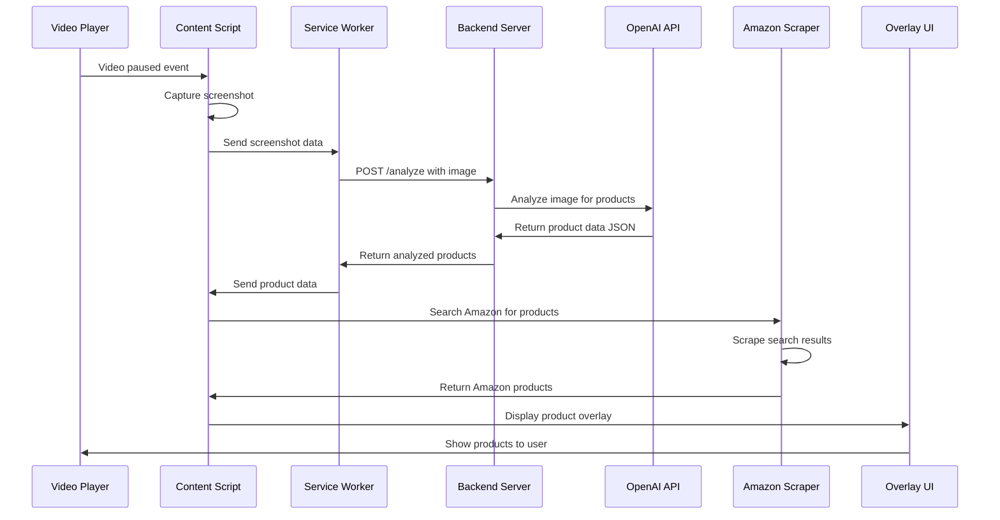

# PauseShop Chrome Extension Architecture Plan

## Project Overview

PauseShop is a Chrome extension that detects when videos are paused on streaming platforms (Netflix, Hulu, etc.), captures screenshots, analyzes them for products using OpenAI API, and displays Amazon shopping suggestions through an injected overlay UI.

## Project Structure

```
pauseshop/
├── extension/                 # Chrome extension code
│   ├── src/
│   │   ├── content/          # Content scripts
│   │   ├── background/       # Service worker
│   │   ├── ui/              # UI components and overlay
│   │   ├── scraper/         # Amazon scraping logic
│   │   ├── utils/           # Shared utilities
│   │   └── types/           # TypeScript type definitions
│   ├── public/              # Static assets
│   ├── manifest.json        # Manifest V3 configuration
│   ├── package.json
│   ├── tsconfig.json
│   ├── webpack.config.js    # Build configuration
│   └── tests/               # Unit and integration tests
├── server/                   # Backend Express.js server
│   ├── src/
│   │   ├── routes/          # API endpoints
│   │   ├── services/        # Business logic
│   │   ├── middleware/      # Express middleware
│   │   ├── utils/           # Server utilities
│   │   └── types/           # Server-specific types
│   ├── package.json
│   ├── tsconfig.json
│   └── tests/               # Server tests
├── docs/                     # Documentation
├── .gitignore
├── README.md
└── package.json             # Root package.json for workspace
```

## Architecture Overview



## Chrome Extension Components

### Content Scripts (`extension/src/content/`)
- **`video-detector.ts`** - Detects video elements and pause events across streaming platforms
- **`screenshot-capturer.ts`** - Captures screenshots of paused video frames
- **`ui-injector.ts`** - Injects and manages the product overlay UI in the DOM
- **`main-content.ts`** - Orchestrates all content script functionality

### Service Worker (`extension/src/background/`)
- **`service-worker.ts`** - Handles extension lifecycle and API communication
- **`api-client.ts`** - Manages communication with backend server

### UI Components (`extension/src/ui/`)
- **`overlay.ts`** - Main product overlay component that appears on pause
- **`product-grid.ts`** - Vertical product display grid
- **`product-card.ts`** - Individual product card component with expand functionality
- **`styles.css`** - Overlay styling and responsive design

### Amazon Scraper (`extension/src/scraper/`)
- **`amazon-search.ts`** - Performs Amazon product searches based on detected items
- **`product-parser.ts`** - Parses Amazon product pages for relevant information
- **`scraper-utils.ts`** - Scraping utilities and helper functions

## Backend Server Components

### API Routes (`server/src/routes/`)
- **`analyze.ts`** - POST endpoint for image analysis using OpenAI
- **`health.ts`** - Health check endpoint for monitoring

### Services (`server/src/services/`)
- **`openai-service.ts`** - OpenAI API integration and prompt management
- **`image-processor.ts`** - Image processing utilities and validation

## Data Flow Architecture



## Key Technical Decisions

### Chrome Extension
- **Manifest V3**: Using service workers instead of background scripts for better security and performance
- **TypeScript**: Strict typing throughout the entire project
- **Webpack**: Bundling and build process for the extension
- **DOM Injection**: Direct overlay injection into streaming platform pages
- **Client-side Scraping**: Amazon scraping happens in the extension to offload server costs

### Backend Server
- **Express.js**: Traditional REST API for reliable image analysis handling
- **OpenAI Integration**: Dedicated service for AI-powered product detection
- **Minimal Scope**: Backend only handles image analysis, not product searching

### Development Practices
- **Modular Architecture**: Clear separation of concerns across all components
- **Test-Driven Development**: Unit tests for each module, integration tests for workflows
- **Clean Code**: Self-descriptive code with conservative commenting

## Development Workflow

1. **Extension Development**: Hot reload during development with webpack dev server
2. **Testing Strategy**: Comprehensive unit and integration testing
3. **Build Process**: Automated bundling and packaging for distribution
4. **Local Development**: Backend server runs locally, extension loads unpacked for testing

## Security Considerations

- **Content Security Policy**: Proper CSP configuration in manifest
- **Minimal Permissions**: Only request necessary permissions in manifest
- **API Security**: Secure communication between extension and backend
- **Data Privacy**: No sensitive user data storage or transmission

## Performance Features

- **Error Handling**: Comprehensive error handling and logging throughout
- **Efficient DOM Manipulation**: Optimized UI injection and cleanup
- **Memory Management**: Proper cleanup when videos resume
- **Responsive Design**: UI adapts to different screen sizes and video players

This architecture provides a solid foundation that is modular, scalable, maintainable, and testable, following the clean code principles outlined in the project guidelines.