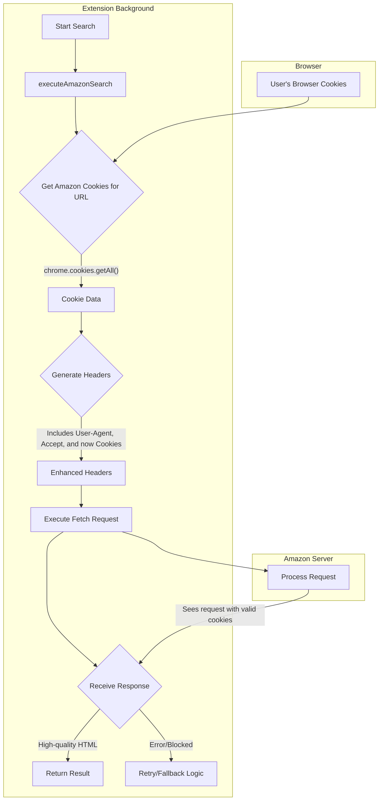

# Plan: Cookie-Enhanced Fetch Scraping

## 1. Overview

This document outlines a new strategy to significantly improve the quality of Amazon search results by making the extension's `fetch` request indistinguishable from a request made by a real user. The primary issue with the current implementation is the lack of cookies, which causes Amazon to serve lower-quality, generic results.

The proposed solution enhances the existing `fetch` client to automatically include the user's actual Amazon cookies with each request. This makes the request appear as if it's coming from a logged-in user with an established session, which should yield higher-quality search results. The entire process is silent, operates in the background, and respects the user's privacy and experience.

## 2. Implementation Steps

### Step 2.1: Update Manifest Permissions

1.  **Add "cookies" Permission**: Modify `wxt.config.ts` to add the `"cookies"` permission to the manifest. This is required to allow the extension to read browser cookies.
2.  **Verify Host Permissions**: Ensure the necessary host permissions for all relevant Amazon domains (e.g., `*://*.amazon.com/*`, `*://*.amazon.co.uk/*`, etc.) are already present in the manifest to allow cookie access for those domains.

### Step 2.2: Enhance the HTTP Client (`src/amazon/amazon-http-client.ts`)

1.  **Create a Cookie Retrieval Function**:
    *   Implement a new private `async` function, e.g., `getAmazonCookies(url: string)`.
    *   This function will use `chrome.cookies.getAll({ url })` to retrieve all cookies for the given Amazon domain.
    *   It will then format the cookies into a single `Cookie` header string (e.g., `"cookie1=value1; cookie2=value2"`).

2.  **Update Header Generation Logic**:
    *   Modify the `generateRealisticHeaders` function to be `async`.
    *   This function will now invoke `getAmazonCookies()` and wait for the result.
    *   It will add the retrieved cookie string as a `Cookie` header to the request headers object.

3.  **Update Request Execution Flow**:
    *   The `executeAmazonSearchWithRetry` function will need to be updated to `await` the `generateRealisticHeaders` call.

## 3. Flow Diagram

This approach is robust, invisible to the user, and directly addresses the core reason for the poor search results by leveraging the user's existing session with Amazon.