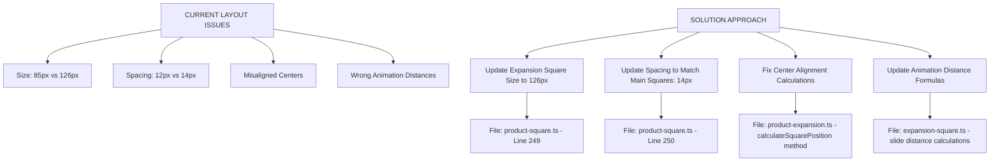
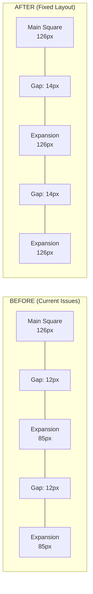

# Horizontal Expansion Layout Improvement Plan

## Overview

This document outlines the comprehensive plan to fix spacing, positioning, and size issues in the horizontal product expansion feature. The goal is to ensure that expansion squares have consistent sizing with main squares and proper center alignment.

## Current Issues Identified

### 1. Size Mismatch
- **Main squares**: 126px (defined in [`ui-manager.ts:53`](../extension/src/ui/ui-manager.ts:53))
- **Expansion squares**: Currently 85px (set in [`product-square.ts:249`](../extension/src/ui/components/product-square.ts:249))
- **Problem**: Expansion squares are ~33% smaller than main squares, creating visual inconsistency

### 2. Spacing Inconsistency
- **Main squares**: 14px vertical spacing (defined in [`ui-manager.ts:54`](../extension/src/ui/ui-manager.ts:54))
- **Expansion squares**: Currently 12px horizontal spacing (set in [`product-square.ts:250`](../extension/src/ui/components/product-square.ts:250))
- **Problem**: Different spacing values create visual imbalance and poor alignment

### 3. Animation Distance Calculations
- Current slide animations use hardcoded spacing values
- [`expansion-square.ts:78`](../extension/src/ui/components/expansion-square.ts:78) and [`expansion-square.ts:97`](../extension/src/ui/components/expansion-square.ts:97) use `(this.config.size + 12)` for positioning
- **Problem**: Animation distances don't match the actual configured spacing

### 4. Center Alignment Issues
- Expansion squares not properly centered with the parent main square
- **Problem**: Visual misalignment when squares expand horizontally

## Solution Architecture



## Implementation Plan

### Phase 1: Update Configuration Values

**File**: [`extension/src/ui/components/product-square.ts`](../extension/src/ui/components/product-square.ts)

**Changes Required**:
- **Line 249**: Change `squareSize: 85` to `squareSize: 126`
- **Line 250**: Change `spacing: 12` to `spacing: 14`

**Rationale**: This ensures expansion squares match the main square size (126px) and use consistent spacing (14px) throughout the UI.

### Phase 2: Fix Animation Distance Calculations

**File**: [`extension/src/ui/components/expansion-square.ts`](../extension/src/ui/components/expansion-square.ts)

**Changes Required**:
- **Line 78**: Update slide distance from `(this.config.size + 12)` to `(this.config.size + spacing)` where spacing comes from config
- **Line 97**: Apply same fix for fallback animation
- **Line 120**: Update hide animation distance calculation

**Implementation Approach**:
```typescript
// Before
const slideDistance = (this.config.index + 1) * (this.config.size + 12);

// After  
const slideDistance = (this.config.index + 1) * (this.config.size + this.config.spacing);
```

**Rationale**: Use dynamic spacing values from configuration instead of hardcoded values for maintainable and consistent animations.

### Phase 3: Verify Center Alignment

**File**: [`extension/src/ui/components/product-expansion.ts`](../extension/src/ui/components/product-expansion.ts)

**Area to Review**: `calculateSquarePosition` method (lines 196-204)

**Verification Points**:
- The `top` position should remain the same as the main square to ensure vertical center alignment
- The `right` positioning calculation should account for updated size and spacing values

**Expected Calculation**:
```typescript
private calculateSquarePosition(index: number): { top: number; right: number } {
    // Position squares to the left of the parent square
    const leftOffset = (index + 1) * (this.config.squareSize + this.config.spacing);
    
    return {
        top: this.config.startPosition.top, // Same as main square for center alignment
        right: this.config.startPosition.right + leftOffset
    };
}
```

### Phase 4: Update Type Definitions (If Needed)

**File**: [`extension/src/ui/types.ts`](../extension/src/ui/types.ts)

**Potential Updates**:
- Add explicit spacing parameter to `ExpansionSquareConfig` interface if needed
- Ensure all animation-related configs are properly typed
- Verify that size and spacing parameters are consistently defined

## Visual Impact Comparison



## Implementation Steps

1. **Configuration Update**
   - Modify size and spacing values in [`product-square.ts`](../extension/src/ui/components/product-square.ts)
   - Test that configuration changes are properly applied

2. **Animation Fixes**
   - Update slide distance calculations in [`expansion-square.ts`](../extension/src/ui/components/expansion-square.ts)
   - Verify smooth animation transitions with new values

3. **Positioning Verification**
   - Ensure center alignment in [`product-expansion.ts`](../extension/src/ui/components/product-expansion.ts)
   - Test visual alignment with main squares

4. **Integration Testing**
   - Verify complete horizontal expansion flow
   - Test multiple expansion scenarios
   - Confirm visual consistency across different screen sizes

## Expected Benefits

### ✅ Visual Consistency
- All squares (main and expansion) will be the same 126px size
- Uniform appearance across the entire UI

### ✅ Proper Spacing  
- 14px spacing matches the main square layout spacing
- Visual harmony between vertical and horizontal layouts

### ✅ Center Alignment
- Expansion squares properly aligned with parent square centers
- Professional, polished appearance

### ✅ Smooth Animations
- Corrected distance calculations for fluid motion
- No jarring or inconsistent movement

### ✅ Maintainable Code
- Configuration-driven values for easy future adjustments
- Consistent spacing and sizing throughout the codebase

## Testing Checklist

- [ ] Main squares still display at 126px
- [ ] Expansion squares now display at 126px (increased from 85px)
- [ ] Horizontal spacing between expansion squares is 14px
- [ ] Expansion squares are vertically centered with main square
- [ ] Slide animations are smooth and properly calculated
- [ ] Multiple expansions work correctly
- [ ] No visual regressions in other UI components

## Risk Assessment

### Low Risk Changes
- Configuration value updates (size and spacing)
- These are isolated changes with clear expected behavior

### Medium Risk Changes  
- Animation distance calculations
- Need careful testing to ensure smooth transitions

### Considerations
- Test on different screen sizes to ensure responsive behavior
- Verify that existing animation timings still feel appropriate with larger squares
- Check for any performance impact with larger square sizes

## Conclusion

This plan addresses all identified issues with the horizontal expansion layout:
- **Size consistency** by making all squares 126px
- **Spacing harmony** by using 14px throughout the UI  
- **Proper alignment** through center positioning
- **Smooth animations** via corrected distance calculations

The implementation is straightforward with minimal risk, focusing on configuration updates and calculation fixes rather than architectural changes.