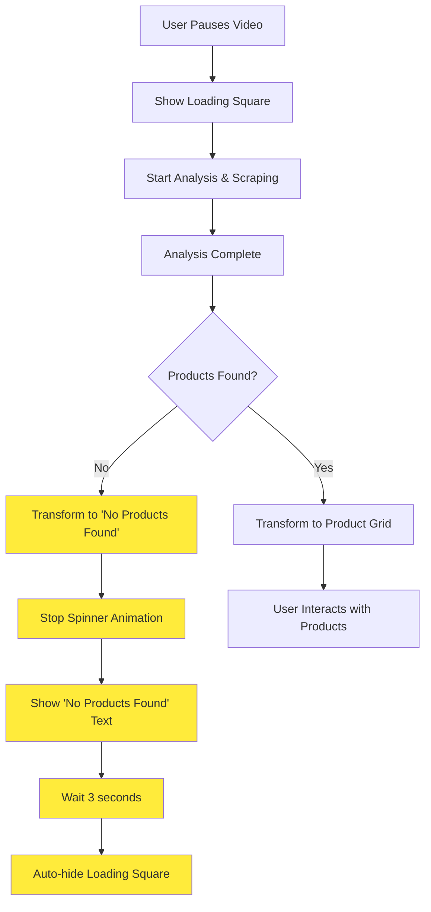

# No Products Found State Implementation Plan

## Overview

Transform the loading square into a "No products found" state that displays for a few seconds before automatically hiding when the analyzer finds no products from its search.

## Problem Analysis

Currently in [`extension/src/content/screenshot-capturer.ts:142`](extension/src/content/screenshot-capturer.ts:142), when no products are found, the loading square remains visible indefinitely:

```typescript
if (productDisplayData.length > 0) {
    await ui.showProductGrid(productDisplayData);
} else {
    log(fullConfig, 'No valid product thumbnails found, keeping loading square visible');
    // ↑ The loading square stays visible indefinitely here
}
```

## Implementation Plan

### Phase 1: Extend Loading States and Types

#### 1.1 Add New Loading State
**File:** [`extension/src/ui/types.ts`](extension/src/ui/types.ts)
- Add `NO_PRODUCTS_FOUND = 'no-products-found'` to [`LoadingState`](extension/src/ui/types.ts:7) enum
- This state represents when analysis completed but found no products

#### 1.2 Update LoadingSquareConfig
**File:** [`extension/src/ui/types.ts`](extension/src/ui/types.ts)
- Add timeout configuration for the "no products found" state:
```typescript
export interface LoadingSquareConfig {
    // ... existing properties
    noProductsFoundTimeout?: number; // milliseconds to show before auto-hide (default: 3000)
}
```

### Phase 2: Enhance Loading Square Component

#### 2.1 Visual State for "No Products Found"
**File:** [`extension/src/ui/components/loading-square.ts`](extension/src/ui/components/loading-square.ts)

**Modify `create()` method:**
- Add a text element for the "no products found" message alongside the spinner
```typescript
// Create no products found text element
const noProductsText = document.createElement('div');
noProductsText.className = 'pauseshop-no-products-text';
noProductsText.textContent = 'No products found';
noProductsText.style.display = 'none'; // Initially hidden
this.element.appendChild(noProductsText);
```

**Modify `updateState()` method:**
- Handle `NO_PRODUCTS_FOUND` state:
  - Stop the pulse animation
  - Hide the spinner
  - Show the "no products found" text with fade-in animation
  - Change visual styling to indicate completion

```typescript
case LoadingState.NO_PRODUCTS_FOUND:
    if (this.animationController) {
        this.animationController.stopAllAnimations();
    }
    // Hide spinner, show text
    const spinner = this.element.querySelector('.pauseshop-loading-spinner');
    const noProductsText = this.element.querySelector('.pauseshop-no-products-text');
    if (spinner) spinner.style.display = 'none';
    if (noProductsText) {
        noProductsText.style.display = 'flex';
        // Add fade-in animation
    }
    break;
```

#### 2.2 Update CSS Styling
**File:** [`extension/src/ui/styles.css`](extension/src/ui/styles.css)
- Add styles for the "no products found" text:
```css
.pauseshop-no-products-text {
    display: flex;
    align-items: center;
    justify-content: center;
    width: 100%;
    height: 100%;
    font-size: 12px;
    font-weight: 500;
    color: rgba(255, 255, 255, 0.9);
    text-align: center;
    opacity: 0;
    transition: opacity 0.3s ease-in-out;
}

.pauseshop-loading-square[data-state="no-products-found"] .pauseshop-no-products-text {
    opacity: 1;
}

.pauseshop-loading-square[data-state="no-products-found"] {
    background: linear-gradient(135deg, rgba(156, 163, 175, 0.95), rgba(107, 114, 128, 0.9));
}
```

### Phase 3: Enhance UI Manager

#### 3.1 Add New Method: `showNoProductsFound()`
**File:** [`extension/src/ui/ui-manager.ts`](extension/src/ui/ui-manager.ts)

```typescript
/**
 * Show "no products found" state and auto-hide after timeout
 */
public async showNoProductsFound(timeoutMs?: number): Promise<boolean> {
    if (!this.loadingSquare?.isVisible()) {
        return false;
    }

    try {
        // Use configured timeout or default
        const timeout = timeoutMs ?? this.loadingSquareConfig.noProductsFoundTimeout ?? 3000;
        
        // Update to no products found state
        this.updateLoadingState(LoadingState.NO_PRODUCTS_FOUND);
        
        // Auto-hide after timeout
        setTimeout(async () => {
            await this.hideLoadingSquare();
        }, timeout);
        
        return true;

    } catch (error) {
        this.log(`Failed to show no products found state: ${error}`);
        return false;
    }
}
```

#### 3.2 Update Default Configuration
**File:** [`extension/src/ui/ui-manager.ts`](extension/src/ui/ui-manager.ts)
- Add default timeout to `loadingSquareConfig`:
```typescript
this.loadingSquareConfig = {
    // ... existing properties
    noProductsFoundTimeout: 3000, // 3 seconds default
    ...loadingSquareConfig
};
```

### Phase 4: Update Screenshot Capturer Logic

#### 4.1 Modify the "No Products" Handling
**File:** [`extension/src/content/screenshot-capturer.ts`](extension/src/content/screenshot-capturer.ts)

**Replace lines 139-143:**
```typescript
if (productDisplayData.length > 0) {
    await ui.showProductGrid(productDisplayData);
} else {
    log(fullConfig, 'No products found, showing temporary message');
    await ui.showNoProductsFound(); // Will auto-hide after 3 seconds
}
```

### Phase 5: Enhanced Error Handling

#### 5.1 Handle Edge Cases
- When no Amazon scraping results are available at all
- When analysis fails completely
- Ensure consistent behavior across different failure scenarios

**File:** [`extension/src/content/screenshot-capturer.ts`](extension/src/content/screenshot-capturer.ts)

**Update the main logic around line 135:**
```typescript
// Check if we have Amazon scraping results to show product grid
if (response.amazonScrapedResults && ui) {
    const amazonResults = response.amazonScrapedResults;
    const productDisplayData = extractProductDisplayData(amazonResults);

    if (productDisplayData.length > 0) {
        await ui.showProductGrid(productDisplayData);
    } else {
        log(fullConfig, 'No products found, showing temporary message');
        await ui.showNoProductsFound();
    }
} else {
    // No scraping results available
    log(fullConfig, 'No scraping results available, showing no products message');
    if (ui) {
        await ui.showNoProductsFound();
    }
}
```

## Flow Diagram



## Expected Behavior Changes

### Before (Current Behavior)
1. User pauses video → Loading square appears with spinner
2. Analysis finds no products → Loading square stays visible indefinitely with spinner
3. User must manually resume video or refresh page to hide it

### After (Improved Behavior)
1. User pauses video → Loading square appears with spinner
2. Analysis finds no products → Loading square shows "No products found" text
3. After 3 seconds → Loading square automatically hides
4. Clean user experience with clear feedback

## Configuration Options

The solution includes configurable timeout via `LoadingSquareConfig`:
- **Default:** 3000ms (3 seconds)
- **Configurable:** Can be adjusted per use case
- **Consistent:** Uses same configuration system as other timeouts

## Testing Scenarios

1. **No products scenario:** Verify text appears and auto-hides
2. **Products found scenario:** Ensure existing behavior unchanged
3. **Error scenarios:** Graceful fallback to no products state
4. **Animation timing:** Smooth transitions between states
5. **Multiple rapid triggers:** Ensure state management is robust

## Files to Modify

1. [`extension/src/ui/types.ts`](extension/src/ui/types.ts) - Add new enum value and config
2. [`extension/src/ui/components/loading-square.ts`](extension/src/ui/components/loading-square.ts) - Visual state handling
3. [`extension/src/ui/ui-manager.ts`](extension/src/ui/ui-manager.ts) - New method and config
4. [`extension/src/ui/styles.css`](extension/src/ui/styles.css) - Styling for new state
5. [`extension/src/content/screenshot-capturer.ts`](extension/src/content/screenshot-capturer.ts) - Logic update

This implementation provides a clean, user-friendly solution that gives clear feedback when no products are found while automatically cleaning up the UI to maintain excellent user experience.