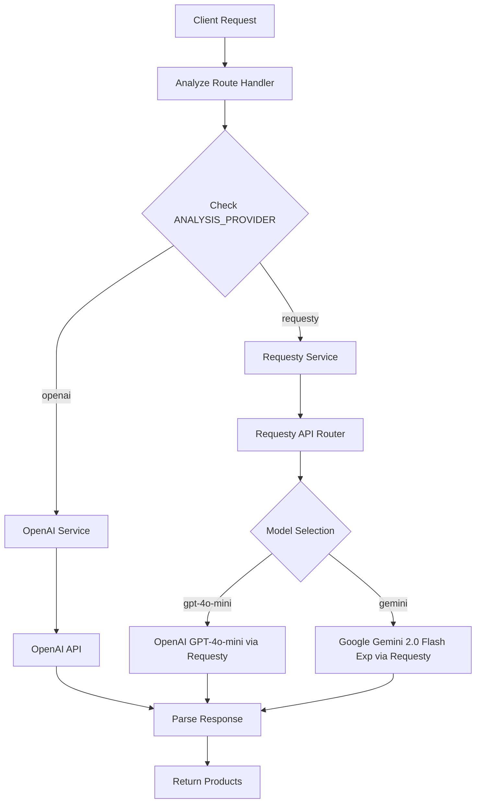

# Requesty API Integration Plan

## Overview
Add a second image analysis method using the Requesty API as an alternative to the current OpenAI implementation, with environment variable configuration to choose between providers.

## Background
The current system uses OpenAI's GPT-4o-mini for image analysis. To potentially improve response times and provide redundancy, we're adding support for the Requesty API, which acts as a router for multiple AI providers including OpenAI and Google models.

## Architecture Design



## Implementation Plan

### Phase 1: Core Infrastructure

#### 1. Create Requesty Service Class
**File**: `server/src/services/requesty-service.ts`

- Similar structure to `OpenAIService` but using Requesty's base URL (`https://router.requesty.ai/v1`)
- Support for both `openai/gpt-4o-mini` and `google/gemini-2.0-flash-exp` models
- Proper error handling for Requesty-specific errors
- Use OpenAI SDK with custom base URL as shown in Requesty documentation

**Key Features**:
- Constructor accepts `RequestyConfig` with API key, model, and optional headers
- `analyzeImage()` method with same signature as OpenAI service
- `parseResponseToProducts()` method for consistent response format
- Error handling for Requesty-specific error codes

#### 2. Update Type Definitions
**File**: `server/src/types/analyze.ts`

Add new interfaces:
```typescript
export interface RequestyConfig {
    apiKey: string;
    model: string;
    maxTokens: number;
    siteUrl?: string;
    siteName?: string;
}

export interface RequestyResponse {
    content: string;
    usage?: {
        promptTokens: number;
        completionTokens: number;
        totalTokens: number;
    };
}

export enum AnalysisProvider {
    OPENAI = 'openai',
    REQUESTY = 'requesty'
}
```

#### 3. Create Provider Factory
**File**: `server/src/services/analysis-provider-factory.ts`

- Factory pattern to instantiate the correct service based on environment variable
- Centralized configuration management
- Interface for consistent service methods across providers

**Key Features**:
```typescript
export interface AnalysisService {
    analyzeImage(imageData: string): Promise<OpenAIResponse | RequestyResponse>;
    parseResponseToProducts(response: string): Product[];
}

export class AnalysisProviderFactory {
    static createProvider(): AnalysisService;
}
```

### Phase 2: Route Integration

#### 4. Update Analyze Route
**File**: `server/src/routes/analyze.ts`

- Modify to use the provider factory instead of directly instantiating OpenAI service
- Add provider-specific error handling
- Maintain backward compatibility
- Update error codes to include provider information

**Changes**:
- Replace `analyzeImageWithOpenAI()` with `analyzeImageWithProvider()`
- Add provider-specific error handling in catch blocks
- Update logging to include provider information

#### 5. Environment Configuration
**File**: `server/.env.example`

Add new environment variables:
```bash
# Analysis Provider Configuration
ANALYSIS_PROVIDER=openai  # openai | requesty

# Requesty Configuration
REQUESTY_API_KEY=your_requesty_api_key_here
REQUESTY_MODEL=google/gemini-2.0-flash-exp  # openai/gpt-4o-mini | google/gemini-2.5-flash-preview-05-20 | google/gemini-2.0-flash-exp
REQUESTY_MAX_TOKENS=10000
REQUESTY_SITE_URL=chrome-extension://pauseshop  # Optional
REQUESTY_SITE_NAME=PauseShop  # Optional
```

### Phase 3: Error Handling & Logging

#### 6. Enhanced Error Handling
- Provider-specific error codes (e.g., `REQUESTY_AUTH_ERROR`, `REQUESTY_RATE_LIMIT`)
- Improved error messages that indicate which provider failed
- Consistent error response format regardless of provider

#### 7. Testing & Validation
- Ensure both providers work correctly with the same input
- Validate response parsing for both APIs
- Test environment variable switching
- Verify error handling for both providers

## Detailed Implementation Structure

### New Files to Create:
1. **`server/src/services/requesty-service.ts`** - Requesty API service implementation
2. **`server/src/services/analysis-provider-factory.ts`** - Provider factory
3. **`server/src/types/requesty.ts`** - Requesty-specific types (if needed)

### Files to Modify:
1. **`server/src/types/analyze.ts`** - Add provider types and interfaces
2. **`server/src/routes/analyze.ts`** - Use provider factory instead of direct OpenAI service
3. **`server/.env.example`** - Add new environment variables

### Environment Variables

#### New Variables:
- `ANALYSIS_PROVIDER`: Controls which provider to use (`openai` | `requesty`)
- `REQUESTY_API_KEY`: API key for Requesty service
- `REQUESTY_MODEL`: Model to use (`openai/gpt-4o-mini` | `google/gemini-2.0-flash-exp`)
- `REQUESTY_MAX_TOKENS`: Maximum tokens for Requesty requests
- `REQUESTY_SITE_URL`: Optional HTTP-Referer header value
- `REQUESTY_SITE_NAME`: Optional X-Title header value

#### Existing Variables (unchanged):
- `OPENAI_API_KEY`: OpenAI API key
- `OPENAI_MODEL`: OpenAI model to use
- `OPENAI_MAX_TOKENS`: Maximum tokens for OpenAI requests

## Implementation Details

### Requesty Service Implementation
The Requesty service will use the OpenAI SDK with a custom base URL:

```typescript
import OpenAI from 'openai';

export class RequestyService {
    private client: OpenAI;
    
    constructor(config: RequestyConfig) {
        this.client = new OpenAI({
            baseURL: 'https://router.requesty.ai/v1',
            apiKey: config.apiKey,
            defaultHeaders: {
                'HTTP-Referer': config.siteUrl || '',
                'X-Title': config.siteName || '',
            },
        });
    }
    
    async analyzeImage(imageData: string): Promise<RequestyResponse> {
        // Similar implementation to OpenAI service
        // but using Requesty-specific configuration
    }
}
```

### Provider Factory Implementation
```typescript
export class AnalysisProviderFactory {
    static createProvider(): AnalysisService {
        const provider = process.env.ANALYSIS_PROVIDER || 'openai';
        
        switch (provider) {
            case 'openai':
                return new OpenAIService(getOpenAIConfig());
            case 'requesty':
                return new RequestyService(getRequestyConfig());
            default:
                throw new Error(`Unknown analysis provider: ${provider}`);
        }
    }
}
```

## Benefits of This Approach

1. **Flexibility**: Easy switching between providers via environment variable
2. **Maintainability**: Clean separation of concerns with factory pattern
3. **Extensibility**: Easy to add more providers in the future
4. **Backward Compatibility**: Existing OpenAI implementation remains unchanged
5. **Performance**: Potential for faster responses through Requesty's routing
6. **Model Diversity**: Access to both OpenAI and Google models
7. **Redundancy**: Alternative provider if one service is down

## Implementation Considerations

### Response Format Consistency
- Ensure both providers return data in the same format
- Both services should implement the same `AnalysisService` interface
- Response parsing should handle provider-specific response formats

### Error Handling
- Provider-specific error codes and messages
- Consistent error response structure
- Proper logging for debugging provider issues

### Rate Limiting
- Different rate limits between providers
- Consider provider-specific retry logic
- Monitor usage patterns across providers

### Cost Optimization
- Monitor usage and costs across providers
- Consider model selection based on cost/performance trade-offs
- Track token usage for both providers

### Prompt Compatibility
- Ensure prompts work well with both OpenAI and Gemini models
- Consider model-specific prompt optimizations
- Test response quality across different models

## Testing Strategy

1. **Unit Tests**: Test each service independently
2. **Integration Tests**: Test provider factory and route integration
3. **Environment Tests**: Test switching between providers
4. **Error Handling Tests**: Test provider-specific error scenarios
5. **Performance Tests**: Compare response times between providers

## Deployment Considerations

1. **Environment Variables**: Ensure all required variables are set
2. **API Keys**: Secure storage of both OpenAI and Requesty API keys
3. **Monitoring**: Track usage, errors, and performance for both providers
4. **Rollback Plan**: Ability to quickly switch back to OpenAI if issues arise

## Future Enhancements

1. **Load Balancing**: Distribute requests across multiple providers
2. **Automatic Fallback**: Fall back to secondary provider if primary fails
3. **A/B Testing**: Compare response quality between providers
4. **Cost Optimization**: Automatic provider selection based on cost/performance
5. **Additional Providers**: Support for more AI service providers