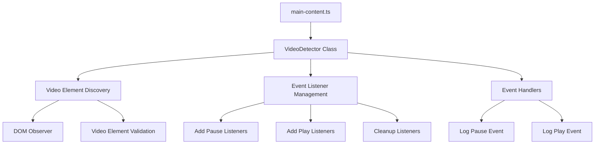
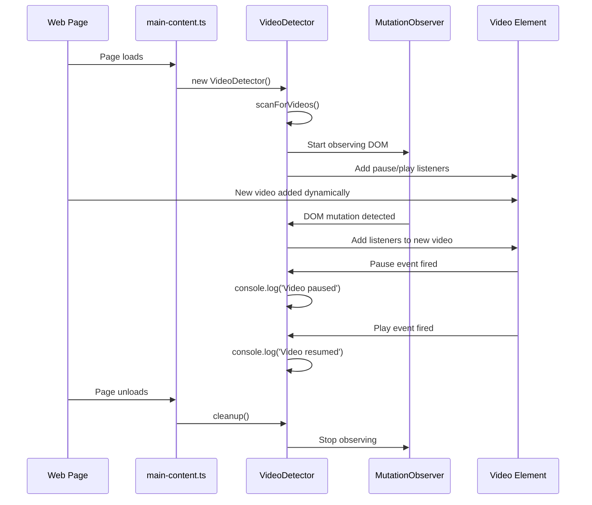

# Task 1.2: Basic Video Detection and Pause Event Listening

## Overview
Implement a generic HTML5 video detection system that listens for pause and play events across all supported streaming platforms, with console logging for verification.

## Simplified Goal
- Detect video elements on streaming platforms
- Listen for pause and play events
- Log events to console for verification
- No metadata extraction needed at this stage

## Architecture Overview



## Implementation Components

### 1. Video Detector Module (`extension/src/content/video-detector.ts`)
**Purpose**: Core class responsible for detecting video elements and managing event listeners

**Key Features**:
- Generic HTML5 video element detection using `document.querySelectorAll('video')`
- MutationObserver for dynamically loaded videos (common in SPAs)
- Event listener management with proper cleanup
- Simple pause/play event logging
- Basic error handling

**Core Methods**:
- `initialize()` - Start video detection and observation
- `scanForVideos()` - Find all current video elements
- `attachVideoListeners(video)` - Add pause/play listeners to a video
- `handlePause(event)` - Log pause events
- `handlePlay(event)` - Log play events
- `cleanup()` - Remove all listeners and observers

### 2. Enhanced Content Script (`extension/src/content/main-content.ts`)
**Purpose**: Initialize video detection system

**Key Features**:
- Create and initialize VideoDetector instance
- Handle page cleanup on unload
- Simple orchestration without complexity

### 3. Basic Types (`extension/src/types/video.ts`)
**Purpose**: Extension-specific type definitions for video detection

**Simple Interfaces**:
- `VideoDetectorConfig` - Basic configuration options
- `VideoEventType` - Enum for pause/play events
- `VideoEventData` - Structure for video event data

## Implementation Flow



## File Structure

```
extension/src/
├── content/
│   ├── main-content.ts          # Enhanced: Initialize VideoDetector
│   └── video-detector.ts        # New: Core video detection logic
├── types/
│   └── video.ts                # New: Video-related type definitions
└── utils/
    └── dom-utils.ts            # New: Simple DOM helper functions (if needed)
```

## Key Technical Decisions

1. **Generic HTML5 Approach**: Use standard `HTMLVideoElement` detection for maximum compatibility
2. **MutationObserver**: Handle dynamically loaded videos in SPAs
3. **Simple Event Handling**: Direct event listeners on video elements
4. **Console Logging Only**: No data collection or processing at this stage
5. **Cleanup Strategy**: Proper event listener removal to prevent memory leaks

## Implementation Details

### VideoDetector Class Structure
```typescript
class VideoDetector {
  private videos: Set<HTMLVideoElement> = new Set();
  private observer: MutationObserver | null = null;

  initialize(): void
  scanForVideos(): void
  attachVideoListeners(video: HTMLVideoElement): void
  handlePause(event: Event): void
  handlePlay(event: Event): void
  cleanup(): void
}
```

### Console Output Examples
```
PauseShop: Video detected and listeners attached
PauseShop: Video paused at 0:45
PauseShop: Video resumed at 0:45
PauseShop: New video detected dynamically
```

## Success Criteria

- ✅ Detects video elements on all supported streaming platforms
- ✅ Logs pause events to console when videos are paused
- ✅ Logs play events to console when videos resume
- ✅ Handles dynamically loaded videos (Netflix, YouTube SPAs)
- ✅ Properly cleans up event listeners on page unload
- ✅ No memory leaks or performance issues
- ✅ Works across different video player implementations

## Testing Strategy

1. **Manual Testing**: 
   - Load Netflix, YouTube, Hulu pages
   - Pause/resume videos and verify console logs
   - Navigate between pages to test cleanup

2. **Browser DevTools**:
   - Monitor console for expected log messages
   - Check for memory leaks in performance tab
   - Verify event listeners are properly removed

## Future Integration

This simplified implementation provides the foundation for:
- **Task 1.3**: Screenshot capture (video elements already identified)
- **Phase 2**: Service worker communication (event structure ready)
- **Phase 4**: UI injection (video references available)

The focus is on getting reliable video detection and event listening working first, then building upon this foundation in subsequent tasks.