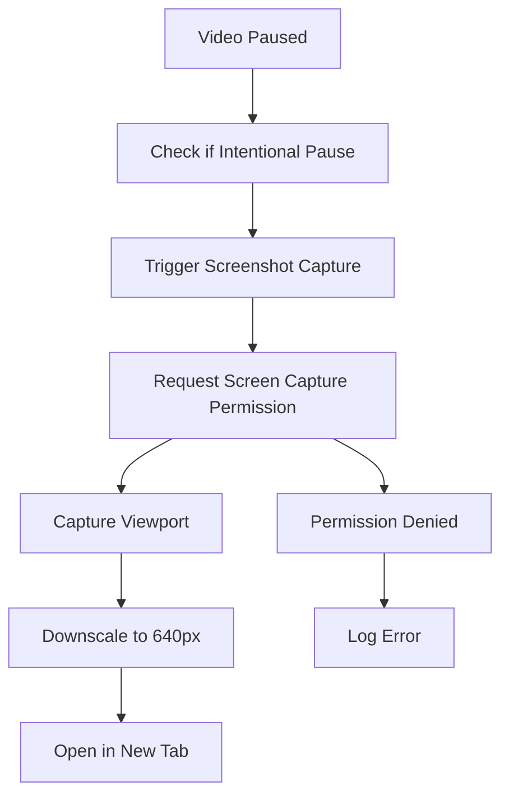
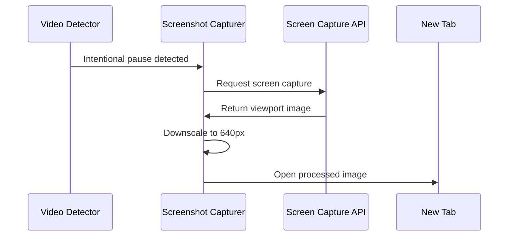

# Task 1.4: Simple Screenshot Capture Functionality

## Objective
Create basic screenshot capture functionality that triggers when a video is paused, captures a screenshot of the viewport, downscales it to 640px width, and opens it in a new tab.

## Scope
This is a simplified implementation focused on core functionality:
1. Trigger screenshot capture on intentional video pause
2. Capture viewport using Screen Capture API
3. Downscale image to 640px width (maintaining aspect ratio)
4. Open processed screenshot in new tab

## Implementation Plan

### 1. Create Screenshot Capturer Module
**File**: `extension/src/content/screenshot-capturer.ts`

**Core Functionality:**
- Use Screen Capture API (`getDisplayMedia()`) to capture viewport
- Downscale captured image to 640px width (maintaining aspect ratio)
- Open processed image in new tab using `window.open()`
- Simple error handling for permission issues

### 2. Integration with Video Detector
**Modify**: `extension/src/content/video-detector.ts`

**Changes:**
- Import screenshot capturer module
- Call screenshot capture function when intentional pause is detected
- Add screenshot capture to the existing pause handler logic

### 3. Implementation Architecture



### 4. Core Functions

**Screenshot Capturer Methods:**
- `captureScreenshot()`: Main function to capture and process screenshot
- `downscaleImage()`: Resize image to 640px width while maintaining aspect ratio
- `openImageInNewTab()`: Display processed image in new browser tab

**Integration Point:**
- Modify `handlePause()` function in video-detector.ts to call screenshot capture

### 5. Data Flow



### 6. File Structure
```
extension/src/content/
├── screenshot-capturer.ts     # Simple screenshot capture logic
└── video-detector.ts          # Modified to include screenshot trigger
```

### 7. Implementation Steps
1. Create basic screenshot capturer module with core functions
2. Integrate screenshot trigger with existing pause detection in video-detector
3. Test screenshot capture and new tab opening functionality
4. Verify 640px downscaling works correctly

### 8. Technical Requirements

**Permissions:**
- Screen capture permission will be requested at runtime
- Handle permission denial gracefully with error logging

**Image Processing:**
- Use Canvas API for image downscaling
- Maintain aspect ratio when resizing to 640px width
- Convert to data URL for new tab display

**Error Handling:**
- Log errors when screen capture permission is denied
- Handle cases where screen capture API is not available
- Graceful fallback with user-friendly error messages

### 9. Success Criteria
- ✅ Screenshot is captured when video is paused (intentional pause only)
- ✅ Image is downscaled to 640px width while maintaining aspect ratio
- ✅ Processed screenshot opens in new tab successfully
- ✅ Basic error handling for permission and API issues
- ✅ Integration works seamlessly with existing video detection

### 10. Testing Approach
**Manual Testing Required:**
- Test on Netflix, Hulu, and other streaming platforms
- Verify screenshot capture triggers only on intentional pauses
- Confirm image downscaling to 640px works correctly
- Test new tab opening with processed image
- Verify error handling when permissions are denied

This simplified implementation provides the foundation for screenshot capture functionality while maintaining focus on the core requirements for task 1.4.

## 11. Implementation Status

**✅ COMPLETED** - Screenshot downscaling functionality has been successfully implemented.

### Final Implementation Details

**Actual Architecture:**
- Screenshot capture is handled by the background service worker using `chrome.tabs.captureVisibleTab`
- Content script communicates with service worker via `chrome.runtime.sendMessage`
- Image downscaling is performed in the service worker using service worker-compatible APIs

**Key Implementation Changes:**
- **Service Worker Implementation**: Screenshot processing moved to background service worker instead of content script
- **Service Worker-Compatible APIs**: Used `createImageBitmap()` and `OffscreenCanvas` instead of DOM `Image()` and Canvas
- **Blob Processing**: Implemented proper blob-to-dataURL conversion for service worker environment

**Code Files Modified:**
- ✅ `extension/src/background/service-worker.ts` - Added `downscaleImage()` function and enhanced `captureScreenshot()`
- ✅ `extension/src/content/screenshot-capturer.ts` - Existing communication module (already functional)

**Technical Implementation:**
```typescript
// Key function added to service-worker.ts
const downscaleImage = async (dataUrl: string, targetWidth: number): Promise<string> => {
  // Uses createImageBitmap() for service worker compatibility
  // Uses OffscreenCanvas for image processing
  // Maintains aspect ratio during downscaling
  // Returns processed data URL
}
```

**Functionality Verified:**
- ✅ Screenshots are captured on intentional video pause
- ✅ Images are downscaled to 640px width maintaining aspect ratio
- ✅ Processed screenshots open in new tabs
- ✅ Service worker compatibility issues resolved
- ✅ Error handling for image processing failures

**Build Status:** ✅ Extension builds successfully without TypeScript errors

### Next Steps
Task 1.4 is complete. The screenshot capture with downscaling functionality is ready for testing on video streaming platforms.