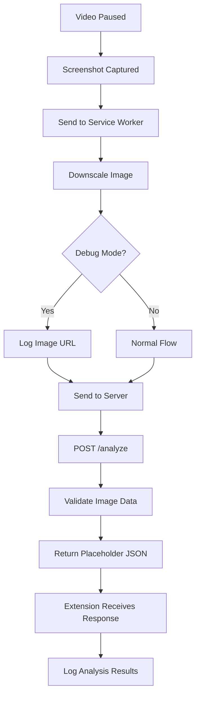
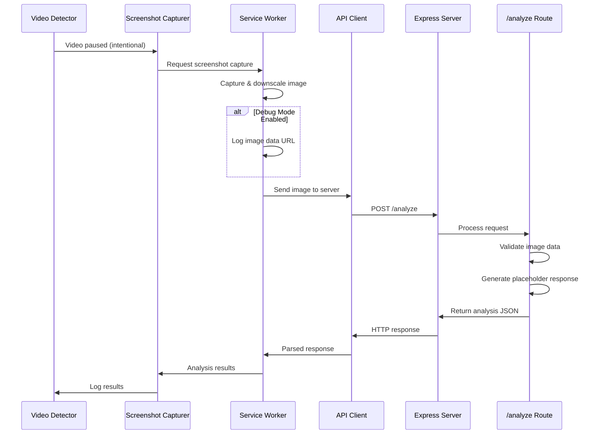

# Task 2.1 Implementation Plan: Image Analysis Endpoint

## Overview
Create a server endpoint `/analyze` that receives screenshot data from the Chrome extension and returns a placeholder JSON response. This task focuses on establishing the communication pipeline between the extension and server, with actual AI analysis to be implemented in later tasks.

## Objectives
1. Create a POST `/analyze` endpoint on the Express server
2. Modify the extension to send screenshot data to the server instead of opening in new tabs
3. Implement proper request/response handling with error management
4. Maintain debug logging functionality for development
5. Establish the foundation for future OpenAI integration

## Architecture Overview



## Implementation Components

### 1. Server-Side Implementation

#### New Route: `/analyze` endpoint
**File**: [`server/src/routes/analyze.ts`](server/src/routes/analyze.ts)

**Functionality**:
- Accept POST requests with image data (base64 or multipart)
- Validate image format and size
- Return structured JSON response for detected products
- Comprehensive error handling for malformed requests

**Request Schema**:
```typescript
interface AnalyzeRequest {
  image: string; // base64 data URL
  metadata?: {
    timestamp: string;
    source: string; // e.g., "netflix", "hulu"
    videoTitle?: string;
  };
}
```

**Response Schema**:
```typescript
interface AnalyzeResponse {
  success: boolean;
  timestamp: string;
  products: ProductDetection[];
  metadata: {
    processingTime: number;
    imageSize: {
      width: number;
      height: number;
    };
  };
}

interface ProductDetection {
  id: string;
  category: string; // "clothing", "electronics", "furniture", etc.
  description: string;
  confidence: number; // 0-1
  boundingBox?: {
    x: number;
    y: number;
    width: number;
    height: number;
  };
}
```

#### Route Integration
**Modify**: [`server/src/routes/index.ts`](server/src/routes/index.ts)
- Add the new analyze route to the router
- Maintain existing health endpoint

#### Type Definitions
**New File**: [`server/src/types/analyze.ts`](server/src/types/analyze.ts)
- Define request/response interfaces
- Image validation types
- Error response schemas

### 2. Extension-Side Implementation

#### Enhanced Service Worker
**Modify**: [`extension/src/background/service-worker.ts`](extension/src/background/service-worker.ts)

**New Functionality**:
- Add server communication logic
- Implement `/analyze` endpoint calling
- Add debug logging for image URLs
- Add configuration for server URL and debug mode

**New Methods**:
- `sendImageToServer(dataUrl: string, config: AnalysisConfig): Promise<AnalysisResponse>`
- `handleAnalysisResponse(response: AnalysisResponse): void`

#### Updated Screenshot Capturer
**Modify**: [`extension/src/content/screenshot-capturer.ts`](extension/src/content/screenshot-capturer.ts)

**Enhanced Configuration**:
```typescript
interface ScreenshotConfig {
  targetWidth: number;
  enableLogging: boolean;
  logPrefix: string;
  debugMode: boolean; // New: controls debug logging vs normal flow
  serverUrl: string;  // New: server endpoint URL
}
```

#### New API Client Module
**New File**: [`extension/src/background/api-client.ts`](extension/src/background/api-client.ts)

**Purpose**: Centralized server communication
- HTTP request handling with proper error management
- Response parsing and validation
- Retry logic for network failures
- CORS handling for extension-to-server communication

### 3. Data Flow Implementation



## Detailed Implementation Plan

### Phase 1: Server Endpoint Creation
1. **Create analyze route handler**
   - Implement request validation
   - Add image format checking
   - Create placeholder response generation
   - Add comprehensive error handling

2. **Update route registration**
   - Add analyze route to main router
   - Ensure proper middleware application
   - Test endpoint accessibility

3. **Add type definitions**
   - Define request/response interfaces
   - Create validation schemas
   - Add error response types

### Phase 2: Extension Communication Setup
1. **Create API client module**
   - Implement HTTP request handling
   - Add response parsing logic
   - Include retry mechanisms
   - Handle CORS and authentication

2. **Enhance service worker**
   - Add server communication capability
   - Implement debug mode logging
   - Remove new tab opening functionality
   - Add configuration management

### Phase 3: Integration & Flow Modification
1. **Update screenshot capturer**
   - Add server communication option
   - Implement debug mode configuration
   - Remove new tab functionality entirely
   - Add proper error handling

2. **Modify video detector integration**
   - Update pause handler to use new flow
   - Add configuration for debug vs production mode
   - Ensure proper error propagation

### Phase 4: Testing & Validation
1. **Server endpoint testing**
   - Test with various image formats
   - Validate error handling scenarios
   - Check CORS configuration
   - Verify response format consistency

2. **Extension integration testing**
   - Test screenshot-to-server flow
   - Verify debug mode logging functionality
   - Check error handling and logging
   - Validate network failure scenarios

## Technical Specifications

### Server Configuration
```typescript
// Enhanced CORS for image uploads
app.use(cors({
  origin: ['chrome-extension://*'],
  methods: ['GET', 'POST', 'OPTIONS'],
  allowedHeaders: ['Content-Type', 'Authorization'],
  maxAge: 86400 // 24 hours
}));

// Enhanced body parser for images
app.use(express.json({ limit: '10mb' })); // Already configured
```

### Extension Configuration
```typescript
const defaultConfig = {
  targetWidth: 640,
  enableLogging: true,
  logPrefix: 'PauseShop',
  debugMode: false, // New: false = normal flow, true = additional debug logging
  serverUrl: 'http://localhost:3000' // New: configurable server URL
};
```

### Debug Mode Behavior
- **Debug Mode ON**: Log the image data URL to console, then proceed with normal server communication
- **Debug Mode OFF**: Normal flow - capture, downscale, send to server
- **Both modes**: Always send to server and process response

### Error Handling Strategy
- **Server**: Structured error responses with proper HTTP status codes
- **Extension**: Graceful error handling with detailed logging
- **Logging**: Comprehensive logging for debugging and monitoring
- **Validation**: Input validation on both client and server sides

## File Structure Changes

```
server/src/
├── routes/
│   ├── index.ts              # Modified: Add analyze route
│   ├── health.ts             # Existing
│   └── analyze.ts            # New: Image analysis endpoint
├── types/
│   ├── index.ts              # Existing
│   └── analyze.ts            # New: Analysis-specific types
└── utils/
    ├── index.ts              # Existing
    └── image-validator.ts    # New: Image validation utilities

extension/src/
├── background/
│   ├── service-worker.ts     # Modified: Add server communication
│   └── api-client.ts         # New: Server communication module
└── content/
    └── screenshot-capturer.ts # Modified: Add server option
```

## Success Criteria

- ✅ POST `/analyze` endpoint accepts image data and returns structured JSON
- ✅ Extension sends screenshot data to server for all flows
- ✅ Debug mode provides additional logging without changing the core flow
- ✅ New tab functionality is completely removed
- ✅ Proper error handling for network failures and invalid requests
- ✅ CORS configuration allows extension-to-server communication
- ✅ Response format is consistent and ready for future AI integration
- ✅ Comprehensive logging for debugging and monitoring
- ✅ Both debug and normal modes follow the same communication path

## Future Integration Points

This implementation provides the foundation for:
- **Task 2.2**: OpenAI service integration (replace placeholder response)
- **Task 2.3**: Enhanced prompt engineering (use structured request data)
- **Task 2.4**: Response interpretation (parse actual AI analysis)
- **Phase 3**: Amazon integration (use detected products for search)

## Testing Strategy

**Manual Testing Required**:
1. Test server endpoint with curl/Postman using base64 image data
2. Test extension screenshot capture with server communication
3. Verify debug mode logging functionality
4. Test error scenarios (server down, invalid images, network failures)
5. Validate CORS configuration with actual extension requests

The focus is on establishing reliable communication between extension and server, with placeholder responses that match the expected structure for future AI integration.