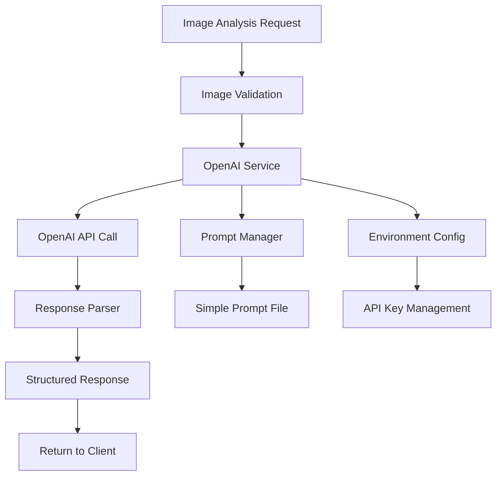
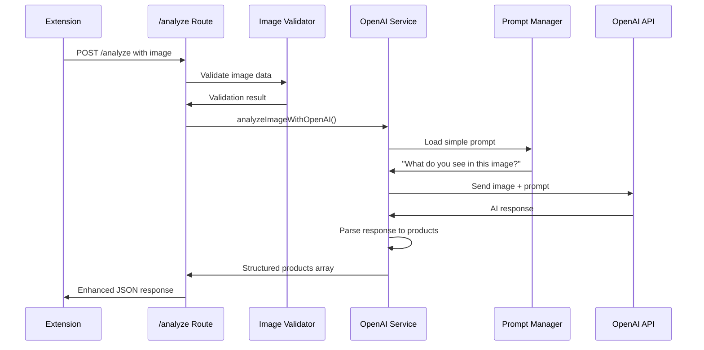

# Task 2.2 Implementation Plan: OpenAI Service Integration

## Overview
Integrate OpenAI's GPT-4o-mini API into the existing `/analyze` endpoint to replace placeholder responses with actual AI-powered image analysis. The implementation will be minimal and modular, using a simple "What do you see in this image?" prompt for initial testing.

## Current State Analysis
Based on examination of the codebase:
- ✅ [`/analyze`](server/src/routes/analyze.ts:30) endpoint exists with image validation
- ✅ Placeholder response generation in [`generatePlaceholderAnalysis()`](server/src/routes/analyze.ts:14)
- ✅ Type definitions in [`server/src/types/analyze.ts`](server/src/types/analyze.ts:5)
- ✅ Image validation utilities in [`server/src/utils/image-validator.ts`](server/src/utils/image-validator.ts)
- ❌ No OpenAI dependency or service layer yet

## Implementation Architecture



## Detailed Implementation Plan

### Phase 1: Dependencies and Environment Setup

#### 1.1 Add OpenAI Dependency
**Modify**: [`server/package.json`](server/package.json:31)
```json
"dependencies": {
  "express": "^4.18.2",
  "multer": "^1.4.5-lts.1", 
  "cors": "^2.8.5",
  "helmet": "^7.0.0",
  "openai": "^4.0.0",
  "dotenv": "^16.0.0"
}
```

#### 1.2 Environment Configuration
**Create**: `server/.env.example`
```env
# OpenAI Configuration
OPENAI_API_KEY=your_openai_api_key_here
OPENAI_MODEL=gpt-4o-mini
OPENAI_MAX_TOKENS=150
```

**Create**: `server/.env` (for local development)
- Copy from `.env.example`
- Add actual API key

**Update**: [`server/src/index.ts`](server/src/index.ts) to load environment variables

### Phase 2: OpenAI Service Layer

#### 2.1 Create OpenAI Service
**Create**: `server/src/services/openai-service.ts`

**Core Functionality**:
- Initialize OpenAI client with API key from environment
- Send image to GPT-4o-mini with simple prompt
- Handle API errors and rate limiting
- Parse response into structured format

**Key Methods**:
```typescript
class OpenAIService {
  private client: OpenAI;
  
  constructor(config: OpenAIConfig);
  async analyzeImage(imageData: string, prompt: string): Promise<OpenAIResponse>;
  private parseResponseToProducts(response: string): Product[];
  private handleAPIError(error: any): never;
}
```

#### 2.2 Create Prompt Manager
**Create**: `server/src/prompts/image-analysis.txt`
```
What do you see in this image?
```

**Create**: `server/src/services/prompt-manager.ts`
- Load prompts from file system
- Manage prompt versioning for future expansion
- Simple prompt retrieval interface

**Key Methods**:
```typescript
class PromptManager {
  static async loadPrompt(promptName: string): Promise<string>;
  static getImageAnalysisPrompt(): Promise<string>;
}
```

### Phase 3: Integration with Existing Endpoint

#### 3.1 Update Type Definitions
**Modify**: [`server/src/types/analyze.ts`](server/src/types/analyze.ts:21)

**Enhanced Product Interface**:
```typescript
export interface Product {
  id: string;
  category: string; // "clothing", "electronics", "furniture", "other"
  description: string;
  confidence: number; // 0-1
}
```

**New OpenAI Types**:
```typescript
export interface OpenAIConfig {
  apiKey: string;
  model: string;
  maxTokens: number;
}

export interface OpenAIResponse {
  content: string;
  usage?: {
    promptTokens: number;
    completionTokens: number;
    totalTokens: number;
  };
}
```

#### 3.2 Replace Placeholder Logic
**Modify**: [`server/src/routes/analyze.ts`](server/src/routes/analyze.ts:14)

**Replace [`generatePlaceholderAnalysis()`](server/src/routes/analyze.ts:14) with**:
```typescript
const analyzeImageWithOpenAI = async (imageData: string): Promise<Product[]> => {
  const openaiService = new OpenAIService(openaiConfig);
  const prompt = await PromptManager.getImageAnalysisPrompt();
  const response = await openaiService.analyzeImage(imageData, prompt);
  return openaiService.parseResponseToProducts(response.content);
};
```

**Update [`analyzeImageHandler()`](server/src/routes/analyze.ts:30)**:
- Replace placeholder call with OpenAI service call
- Add OpenAI-specific error handling
- Include token usage in response metadata

### Phase 4: Error Handling and Logging

#### 4.1 Enhanced Error Handling
**OpenAI-Specific Errors**:
- Invalid API key → Return 500 with `OPENAI_AUTH_ERROR`
- Rate limit exceeded → Return 429 with `OPENAI_RATE_LIMIT`
- Network timeout → Return 503 with `OPENAI_TIMEOUT`
- Invalid image format → Return 400 with `OPENAI_INVALID_IMAGE`

#### 4.2 Comprehensive Logging
- OpenAI API call metrics (response time, token usage)
- Error categorization and frequency tracking
- Request/response size monitoring
- API quota usage tracking

## File Structure Changes

```
server/
├── .env.example                    # New: Environment template
├── .env                           # New: Local environment (gitignored)
├── src/
│   ├── services/
│   │   ├── openai-service.ts      # New: OpenAI API integration
│   │   └── prompt-manager.ts      # New: Prompt file management
│   ├── prompts/
│   │   └── image-analysis.txt     # New: Simple prompt file
│   ├── types/
│   │   └── analyze.ts             # Modified: Enhanced types
│   ├── routes/
│   │   └── analyze.ts             # Modified: Replace placeholder
│   └── index.ts                   # Modified: Load environment
```

## Implementation Flow



## Technical Specifications

### OpenAI Service Configuration
```typescript
const openaiConfig: OpenAIConfig = {
  apiKey: process.env.OPENAI_API_KEY!,
  model: process.env.OPENAI_MODEL || 'gpt-4o-mini',
  maxTokens: parseInt(process.env.OPENAI_MAX_TOKENS || '150')
};
```

### Simple Response Parsing Strategy
For the minimal prompt "What do you see in this image?", we'll implement basic parsing:

1. **Category Detection**: Look for keywords indicating product types
   - "clothing", "shirt", "pants" → category: "clothing"
   - "phone", "laptop", "electronics" → category: "electronics"
   - "chair", "table", "furniture" → category: "furniture"
   - Default → category: "other"

2. **Description Extraction**: Use the AI response directly as description
3. **Confidence Assignment**: Based on response certainty indicators
   - Definitive language ("I see a red shirt") → confidence: 0.8-0.9
   - Uncertain language ("appears to be", "might be") → confidence: 0.5-0.7
   - Vague responses → confidence: 0.3-0.5

### Environment Variable Management

#### Development Setup
```bash
# Copy template
cp server/.env.example server/.env

# Add your OpenAI API key
OPENAI_API_KEY=sk-your-actual-api-key-here
OPENAI_MODEL=gpt-4o-mini
OPENAI_MAX_TOKENS=150
```

#### Environment Validation
```typescript
// Validate required environment variables on startup
const requiredEnvVars = ['OPENAI_API_KEY'];
const missingVars = requiredEnvVars.filter(varName => !process.env[varName]);

if (missingVars.length > 0) {
  console.error(`Missing required environment variables: ${missingVars.join(', ')}`);
  process.exit(1);
}
```

## Implementation Steps

### Step 1: Dependencies and Environment
1. Add `openai` and `dotenv` packages to [`server/package.json`](server/package.json)
2. Create `server/.env.example` with OpenAI configuration template
3. Create `server/.env` for local development
4. Update [`server/src/index.ts`](server/src/index.ts) to load environment variables
5. Add environment validation on startup

### Step 2: Service Layer Creation
1. Create [`server/src/services/openai-service.ts`](server/src/services/openai-service.ts)
   - OpenAI client initialization
   - Image analysis method
   - Response parsing logic
   - Error handling
2. Create [`server/src/services/prompt-manager.ts`](server/src/services/prompt-manager.ts)
   - File-based prompt loading
   - Simple prompt retrieval interface
3. Create [`server/src/prompts/image-analysis.txt`](server/src/prompts/image-analysis.txt)
   - Simple "What do you see in this image?" prompt

### Step 3: Type Definitions Enhancement
1. Update [`server/src/types/analyze.ts`](server/src/types/analyze.ts)
   - Enhance [`Product`](server/src/types/analyze.ts:21) interface with id, category, description
   - Add `OpenAIConfig` interface
   - Add `OpenAIResponse` interface
   - Add OpenAI-specific error codes

### Step 4: Integration with Analyze Route
1. Modify [`server/src/routes/analyze.ts`](server/src/routes/analyze.ts)
   - Replace [`generatePlaceholderAnalysis()`](server/src/routes/analyze.ts:14) with OpenAI service call
   - Update [`analyzeImageHandler()`](server/src/routes/analyze.ts:30) to use OpenAI service
   - Add OpenAI-specific error handling
   - Include token usage in response metadata

### Step 5: Testing and Validation
1. Test environment variable loading
2. Test OpenAI API integration with sample images
3. Verify response parsing and product structure
4. Test error handling scenarios
5. Validate extension integration still works

## Success Criteria

- ✅ OpenAI API integration replaces placeholder responses
- ✅ Simple "What do you see in this image?" prompt works
- ✅ API key loaded from environment variables (.env file)
- ✅ Modular prompt management for future expansion
- ✅ Enhanced error handling for OpenAI API failures
- ✅ Structured product responses with categories and descriptions
- ✅ Comprehensive logging for debugging and monitoring
- ✅ Backward compatibility with existing extension integration
- ✅ Environment variable validation on startup
- ✅ Token usage tracking and reporting

## Testing Strategy

### Manual Testing Checklist
1. **Environment Setup**
   - [ ] Verify `.env` file loads correctly
   - [ ] Test with missing API key (should fail gracefully)
   - [ ] Test with invalid API key (should return proper error)

2. **Basic Integration**
   - [ ] Test with simple screenshot from extension
   - [ ] Verify OpenAI API call is made
   - [ ] Check response format matches expected structure
   - [ ] Validate product categories are assigned correctly

3. **Error Scenarios**
   - [ ] Test with network failures
   - [ ] Test with rate limit scenarios
   - [ ] Test with invalid image data
   - [ ] Verify error codes and messages are appropriate

4. **Extension Integration**
   - [ ] Confirm existing extension flow still works
   - [ ] Verify screenshot capture → server → OpenAI → response flow
   - [ ] Check console logs for proper API metrics

### Development Workflow
1. Set up OpenAI API key in local `.env` file
2. Start server with `npm run dev`
3. Test with sample images using curl or extension
4. Monitor console logs for API call metrics and errors
5. Validate response format and content quality

## Future Expansion Points

This minimal implementation provides foundation for:

### Task 2.3: Enhanced Prompt Engineering
- Replace simple prompt with detailed product detection prompt
- Add JSON response format specification
- Include specific product categories and attributes

### Task 2.4: Response Interpretation Improvements
- Enhanced parsing logic for structured responses
- Confidence scoring improvements
- Product categorization refinement

### Advanced Features
- Multiple prompt templates for different scenarios
- A/B testing for prompt effectiveness
- Response caching for similar images
- Token usage optimization

## Security Considerations

### API Key Management
- Store API key in environment variables only
- Never commit `.env` file to version control
- Use different API keys for development/production
- Implement API key rotation strategy

### Request Validation
- Validate image size and format before sending to OpenAI
- Implement rate limiting to prevent API abuse
- Add request logging for security monitoring
- Sanitize AI responses before returning to client

## Performance Considerations

### API Optimization
- Set appropriate token limits to control costs
- Implement request timeout handling
- Add retry logic for transient failures
- Monitor API usage and costs

### Response Caching
- Consider caching responses for identical images
- Implement cache invalidation strategy
- Monitor cache hit rates and effectiveness

This implementation plan provides a solid foundation for integrating OpenAI into the PauseShop backend while maintaining modularity and extensibility for future enhancements.