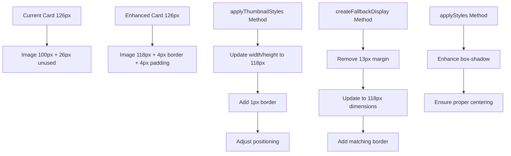

# Product Card Image Enhancement Plan

## Overview
This plan outlines the improvements to make product images take up the entirety of the UI cards while maintaining elegant visual design through subtle borders and enhanced shadows.

## Current State Analysis
Based on analysis of [`product-square.ts`](../extension/src/ui/components/product-square.ts), the current implementation has:
- Card size: 126px × 126px
- Image size: 100px × 100px (leaving 26px unused space)
- Fallback display: 100px × 100px with 13px margin
- Current box-shadow: `0 4px 12px rgba(0, 0, 0, 0.3)`

## Proposed Changes

### 1. Image Sizing Modifications
- **Thumbnail Image**: Expand from 100px × 100px to 118px × 118px (leaving 4px padding for elegant border)
- **Fallback Display**: Remove the 13px margin and expand to match thumbnail size
- **Border**: Add 1px elegant border with subtle color

### 2. Visual Enhancement
- **Box Shadow**: Enhance the existing shadow to create more lift and depth
- **Border Styling**: Implement a thin, elegant border using `rgba(255, 255, 255, 0.2)` for a subtle glass effect
- **Positioning**: Center the larger image perfectly within the card

### 3. Implementation Strategy

### 4. Specific Code Changes Required

#### In `applyThumbnailStyles()` method (lines 415-428):
- Change width/height from `100px` to `118px`
- Add border: `1px solid rgba(255, 255, 255, 0.2)`
- Adjust border-radius to maintain visual consistency
- Update positioning for perfect centering

#### In `createFallbackDisplay()` method (lines 329-350):
- Change width/height from `100px` to `118px`
- Remove the `margin: '13px'` property
- Add matching border styling
- Update positioning

#### In `applyStyles()` method (lines 384-410):
- Enhance box-shadow for more elevation
- Ensure flexbox centering works with new dimensions

### 5. Visual Design Specifications
- **New Image Size**: 118px × 118px
- **Border**: 1px solid rgba(255, 255, 255, 0.2)
- **Enhanced Box Shadow**: `0 8px 24px rgba(0, 0, 0, 0.4), 0 4px 12px rgba(0, 0, 0, 0.2)`
- **Border Radius**: Maintain 8px on image to complement card's 14px radius
- **Padding**: 4px effective padding (3px + 1px border) around image

### 6. Benefits of This Approach
- **Maximum Image Visibility**: Uses 93% of card space vs current 62%
- **Elegant Aesthetics**: Thin border provides sophisticated visual separation
- **Enhanced Depth**: Improved box-shadow creates better visual hierarchy
- **Consistent Styling**: Maintains design language while maximizing impact
- **Responsive Design**: Changes work across all screen sizes

## Implementation Files
- Primary file: [`extension/src/ui/components/product-square.ts`](../extension/src/ui/components/product-square.ts)
- Methods to modify:
  - `applyThumbnailStyles()` (lines 415-428)
  - `createFallbackDisplay()` (lines 329-350)
  - `applyStyles()` (lines 384-410)

## Expected Outcome
Product cards will display images that nearly fill the entire card space while maintaining elegant visual separation through subtle borders and enhanced depth through improved shadows.