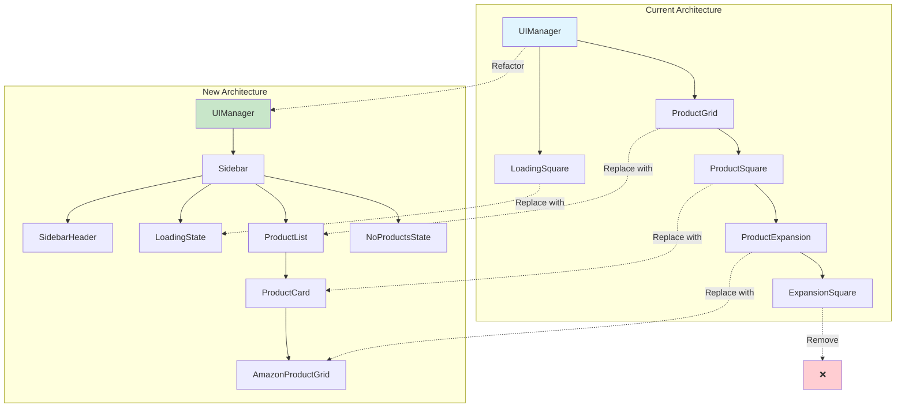
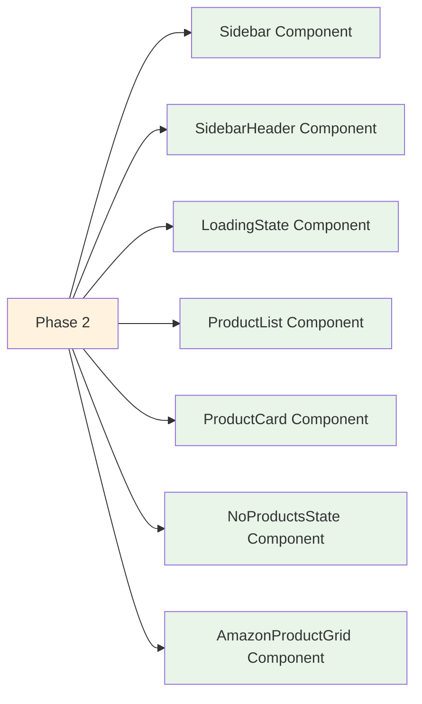

# PauseShop UI Redesign Migration Plan

## Executive Summary

This plan transforms the PauseShop Chrome extension from a minimal floating squares interface to a modern, immersive glassmorphic sidebar experience. The migration maintains all existing functionality while fundamentally changing the user interaction paradigm from "minimal overlay" to "dedicated shopping interface."

## Current vs. New Architecture Analysis

### Current Architecture

- **Layout**: Minimal floating squares (126x126px) positioned on right side
- **Interaction**: Horizontal expansion for additional products
- **Styling**: CSS-in-JS with custom styles in [`styles.css`](extension/src/ui/styles.css:1)
- **Components**: [`UIManager`](extension/src/ui/ui-manager.ts:10) → [`ProductGrid`](extension/src/ui/components/product-grid.ts:9) → [`ProductSquare`](extension/src/ui/components/product-square.ts:11)
- **States**: Loading square transforms into product grid

### New Architecture (Target)

- **Layout**: Full-height sidebar (400px wide) sliding from right
- **Interaction**: Vertical accordion-style expansion within sidebar
- **Styling**: Tailwind CSS with glassmorphic design, Inter font
- **Components**: UIManager → Sidebar → ProductList → ProductCard
- **States**: Loading → Products → No Products (all within sidebar)

## Component Mapping Analysis



## Implementation Phases

### Phase 1: Build Process & Tailwind Integration

**Goal**: Set up Tailwind CSS in the webpack build process

**Tasks**:

1. **Update [`webpack.config.js`](extension/webpack.config.js:1)**:

    - Add PostCSS loader for Tailwind processing
    - Configure CSS extraction for production builds
    - Set up Inter font loading

2. **Add Dependencies**:

    ```bash
    npm install -D tailwindcss postcss postcss-loader autoprefixer
    npm install inter-ui
    ```

3. **Create Tailwind Config**:

    - [`tailwind.config.js`](extension/tailwind.config.js:1) with PauseShop-specific customizations
    - Enable JIT mode for smaller builds
    - Configure color palette to match design

4. **Create Base CSS File**:
    - [`base.css`](extension/src/ui/base.css:1) with Tailwind imports
    - Custom CSS variables for glassmorphic effects

**Deliverables**:

- ✅ Tailwind CSS integrated into build
- ✅ Inter font configured
- ✅ Production-ready CSS generation

---

### Phase 2: New Component Architecture

**Goal**: Create new sidebar-based components alongside existing ones



**New Components to Create**:

1. **[`Sidebar`](extension/src/ui/components/sidebar.ts:1)**:

    - Full-height container with glassmorphic styling
    - Slide-in/slide-out animations
    - Manages child component states

2. **[`SidebarHeader`](extension/src/ui/components/sidebar-header.ts:1)**:

    - PauseShop logo and branding
    - Close button functionality
    - Glassmorphic header styling

3. **[`LoadingState`](extension/src/ui/components/loading-state.ts:1)**:

    - Replaces [`LoadingSquare`](extension/src/ui/components/loading-square.ts:1)
    - Centered spinner with descriptive text
    - Maintains loading/processing states

4. **[`ProductList`](extension/src/ui/components/product-list.ts:1)**:

    - Replaces [`ProductGrid`](extension/src/ui/components/product-grid.ts:1)
    - Vertical scrollable list
    - Manages ProductCard components

5. **[`ProductCard`](extension/src/ui/components/product-card.ts:1)**:

    - Replaces [`ProductSquare`](extension/src/ui/components/product-square.ts:1)
    - Accordion-style expansion
    - Thumbnail and metadata display

6. **[`AmazonProductGrid`](extension/src/ui/components/amazon-product-grid.ts:1)**:

    - Replaces expansion functionality
    - 2-column grid within expanded card
    - Click-to-open Amazon products

7. **[`NoProductsState`](extension/src/ui/components/no-products-state.ts:1)**:
    - Dedicated empty state component
    - Search icon and helpful messaging

**Type Updates**:

- Update [`types.ts`](extension/src/ui/types.ts:1) with new component configs
- Add sidebar-specific enums and interfaces
- Maintain backward compatibility during transition

---

### Phase 3: UI Manager Migration

**Goal**: Update [`UIManager`](extension/src/ui/ui-manager.ts:10) to orchestrate sidebar instead of floating components

**Key Changes**:

1. **State Management**:

    ```typescript
    // OLD: Multiple component states
    private loadingSquare: LoadingSquare | null = null;
    private productGrid: ProductGrid | null = null;

    // NEW: Single sidebar state
    private sidebar: Sidebar | null = null;
    private currentSidebarState: SidebarState = SidebarState.HIDDEN;
    ```

2. **Lifecycle Methods**:

    ```typescript
    // Replace showLoadingSquare() with showSidebar()
    public async showSidebar(): Promise<boolean>

    // Replace showProductGrid() with showProducts()
    public async showProducts(products: ProductDisplayData[]): Promise<boolean>

    // Replace hideUI() with hideSidebar()
    public async hideSidebar(): Promise<boolean>
    ```

3. **Animation Orchestration**:
    - Single slide-in animation for sidebar
    - State transitions within sidebar (loading → products → no products)
    - Smooth accordion animations for product expansion

**Migration Strategy**:

- Keep existing methods as deprecated wrappers initially
- Gradually migrate callers to new sidebar methods
- Remove old methods in Phase 4

---

### Phase 4: Integration & Cleanup

**Goal**: Replace all old components and remove deprecated code

**Tasks**:

1. **Component Removal**:

    - Delete [`ProductSquare`](extension/src/ui/components/product-square.ts:1)
    - Delete [`ProductGrid`](extension/src/ui/components/product-grid.ts:1)
    - Delete [`ProductExpansion`](extension/src/ui/components/product-expansion.ts:1)
    - Delete [`ExpansionSquare`](extension/src/ui/components/expansion-square.ts:1)
    - Delete [`LoadingSquare`](extension/src/ui/components/loading-square.ts:1)

2. **CSS Migration**:

    - Remove old styles from [`styles.css`](extension/src/ui/styles.css:1)
    - Convert remaining utility styles to Tailwind
    - Keep only browser compatibility and reset styles

3. **Type Cleanup**:

    - Remove deprecated interfaces from [`types.ts`](extension/src/ui/types.ts:1)
    - Clean up unused enums and configs
    - Consolidate sidebar-related types

4. **Testing & Validation**:
    - Verify all existing functionality works
    - Test edge cases and error scenarios
    - Validate performance impact

---

### Phase 5: Optimization & Polish

**Goal**: Final optimizations and enhancements

**Tasks**:

1. **Performance Optimization**:

    - Tree-shake unused Tailwind classes
    - Optimize animation performance
    - Minimize bundle size impact

2. **Accessibility Enhancements**:

    - Add proper ARIA labels
    - Keyboard navigation support
    - Screen reader compatibility

3. **Responsive Improvements**:

    - Mobile-friendly sidebar sizing
    - Adaptive layouts for different screen sizes
    - Touch interaction optimizations

4. **Advanced Features**:
    - Smooth scroll within product list
    - Enhanced loading states
    - Improved error handling and recovery

---

## Technical Implementation Details

### Tailwind Configuration

```javascript
// tailwind.config.js
module.exports = {
    content: ["./src/**/*.{ts,html}"],
    theme: {
        extend: {
            fontFamily: {
                inter: ["Inter", "system-ui", "sans-serif"],
            },
            colors: {
                pauseshop: {
                    primary: "#4F46E5",
                    secondary: "#6366F1",
                    glass: "rgba(15, 23, 42, 0.8)",
                },
            },
            backdropBlur: {
                pauseshop: "20px",
            },
        },
    },
    plugins: [],
};
```

### Component Interface Evolution

```typescript
// OLD: ProductSquareConfig
interface ProductSquareConfig {
    size: number;
    position: { top: number; right: number };
    // ... square-specific props
}

// NEW: ProductCardConfig
interface ProductCardConfig {
    product: ProductDisplayData;
    onExpand: (card: ProductCard) => void;
    isExpanded: boolean;
    // ... card-specific props
}
```

### Animation Migration

```typescript
// OLD: Horizontal expansion
await this.productSquare.expandHorizontally();

// NEW: Vertical accordion
await this.productCard.toggleExpansion();
```

## Risk Assessment & Mitigation

### High-Risk Areas

1. **Bundle Size Impact**: Tailwind CSS could increase extension size
    - **Mitigation**: Use JIT mode, purge unused classes
2. **Performance Regression**: Sidebar might impact video playback
    - **Mitigation**: Optimize animations, use GPU acceleration
3. **User Experience Disruption**: Major UX change might confuse users
    - **Mitigation**: Smooth transition, maintain familiar functionality

### Medium-Risk Areas

1. **Browser Compatibility**: Glassmorphic effects on older browsers
    - **Mitigation**: Graceful degradation, fallback styles
2. **Content Script Conflicts**: CSS conflicts with host websites
    - **Mitigation**: Proper CSS scoping, high specificity

## Success Metrics

1. **Functionality**: All existing features work in new sidebar
2. **Performance**: < 5% increase in bundle size, no video performance impact
3. **User Experience**: Smooth animations, intuitive interactions
4. **Code Quality**: Clean architecture, maintainable codebase
5. **Visual Design**: Matches new_design.html specification

## Timeline Estimate

- **Phase 1**: 2-3 days (Build setup)
- **Phase 2**: 5-7 days (Component development)
- **Phase 3**: 3-4 days (UI Manager migration)
- **Phase 4**: 2-3 days (Cleanup)
- **Phase 5**: 2-3 days (Polish)

**Total: 14-20 days**

---

This migration plan transforms PauseShop into a modern, immersive shopping experience while maintaining all existing functionality. The phased approach minimizes risk and allows for iterative testing and validation.

## Next Steps

The plan is ready for implementation. Begin with Phase 1 to set up the Tailwind CSS integration and build process updates.
