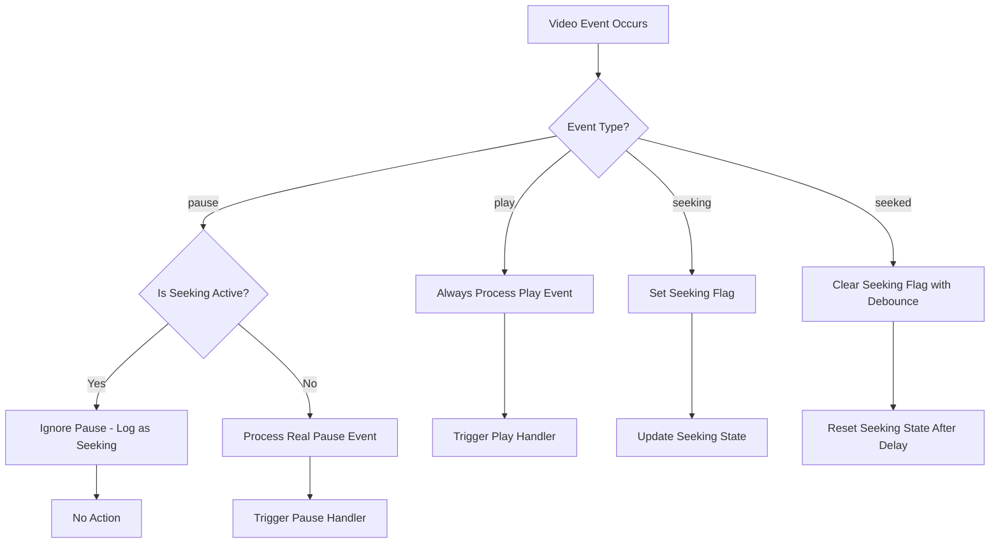

# Task 1.3 Implementation Plan: Smart Pause Detection

## ✅ TASK COMPLETED

**Status**: ✅ Complete
**Testing**: Manual testing confirmed working as expected

## Overview
Enhance the video detector to distinguish between "real" user-initiated pauses and automatic pauses that occur during video seeking operations. The system should:
- Always detect play events (for cleanup purposes)
- Only trigger pause logic for intentional user pauses
- Ignore pause events caused by seeking/scrubbing

## Success Criteria
- Pausing and resuming works as before
- Seeking is not classified as pausing
- We only indicate what we detect through logs for now

### Implementation Summary
- Added seeking state tracking with debounced pause detection
- Implemented pause event debouncing (150ms) to detect if seeking follows a pause
- Enhanced event handlers for `seeking`, `seeked`, and `timeupdate` events
- Added comprehensive logging for debugging seeking vs intentional pause detection
- Maintained existing play event detection for cleanup purposes

## Technical Approach

### 1. Seeking Detection Strategy
We'll track seeking state using multiple video events:
- `seeking` event: Fired when user starts seeking
- `seeked` event: Fired when seeking operation completes
- `timeupdate` event: Monitor for rapid time changes that indicate seeking

### 2. Enhanced Event Handling


### 3. Implementation Components

**Enhanced Video State Tracking:**
- Add seeking state management
- Implement debounce mechanism for seeking completion
- Track time-based seeking detection

**Updated Event Handlers:**
- Modify pause handler to check seeking state
- Keep play handler unchanged (always process)
- Add seeking/seeked event handlers

**Configuration Options:**
- Seeking detection sensitivity
- Debounce timing for seeking completion
- Enable/disable different detection methods

## Detailed Implementation Plan

### Phase 1: Extend Type Definitions
1. Update [`VideoDetectorConfig`](extension/src/types/video.ts:6) to include seeking-related options
2. Add seeking state interface
3. Define seeking detection methods enum

### Phase 2: Enhance Video Detector Core
1. Add seeking state tracking to [`VideoDetectorState`](extension/src/content/video-detector.ts:3)
2. Implement seeking detection logic
3. Add debounce mechanism for seeking completion
4. Update [`attachVideoListeners`](extension/src/content/video-detector.ts:30) to include seeking events

### Phase 3: Smart Pause Logic
1. Modify [`handlePause`](extension/src/content/video-detector.ts:22) to check seeking state
2. Keep [`handlePlay`](extension/src/content/video-detector.ts:26) unchanged
3. Add seeking event handlers
4. Implement time-based seeking detection fallback

### Phase 4: Testing & Validation
1. Test with different video platforms (YouTube, Vimeo, etc.)
2. Validate seeking detection accuracy
3. Test edge cases (rapid seeking, pause during seek, etc.)
4. Performance testing with multiple videos

## Technical Details

### Seeking Detection Methods:
1. **Event-based**: Use `seeking`/`seeked` events (primary method)
2. **Time-based**: Detect rapid `currentTime` changes (fallback)
3. **Debounced completion**: Wait for seeking to stabilize before resuming normal detection

### Configuration Options:
```typescript
interface SeekingDetectionConfig {
  seekingDebounceMs: number;        // Default: 500ms
  timeJumpThreshold: number;        // Default: 1 second
  enableTimeBasedDetection: boolean; // Default: true
}
```

### Event Flow:
1. User starts seeking → `seeking` event → Set seeking flag
2. Pause events during seeking → Ignored with logging
3. User completes seeking → `seeked` event → Start debounce timer
4. After debounce period → Resume normal pause detection
5. Play events → Always processed for cleanup

### Logging Strategy:
- Log when seeking is detected
- Log when pause events are ignored due to seeking
- Log when seeking state changes
- Maintain existing pause/play logging for real events

## Benefits
- Eliminates false positive pause detections during seeking
- Maintains reliable play event detection for cleanup
- Configurable sensitivity for different video platforms
- Robust fallback mechanisms for edge cases
- Clear logging for debugging and monitoring

## Files to Modify
1. [`extension/src/types/video.ts`](extension/src/types/video.ts) - Add seeking-related types
2. [`extension/src/content/video-detector.ts`](extension/src/content/video-detector.ts) - Core seeking detection logic
3. No changes needed to [`extension/src/content/main-content.ts`](extension/src/content/main-content.ts)