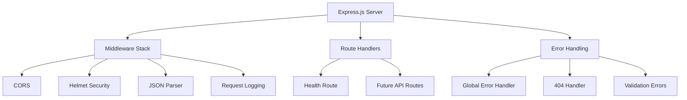
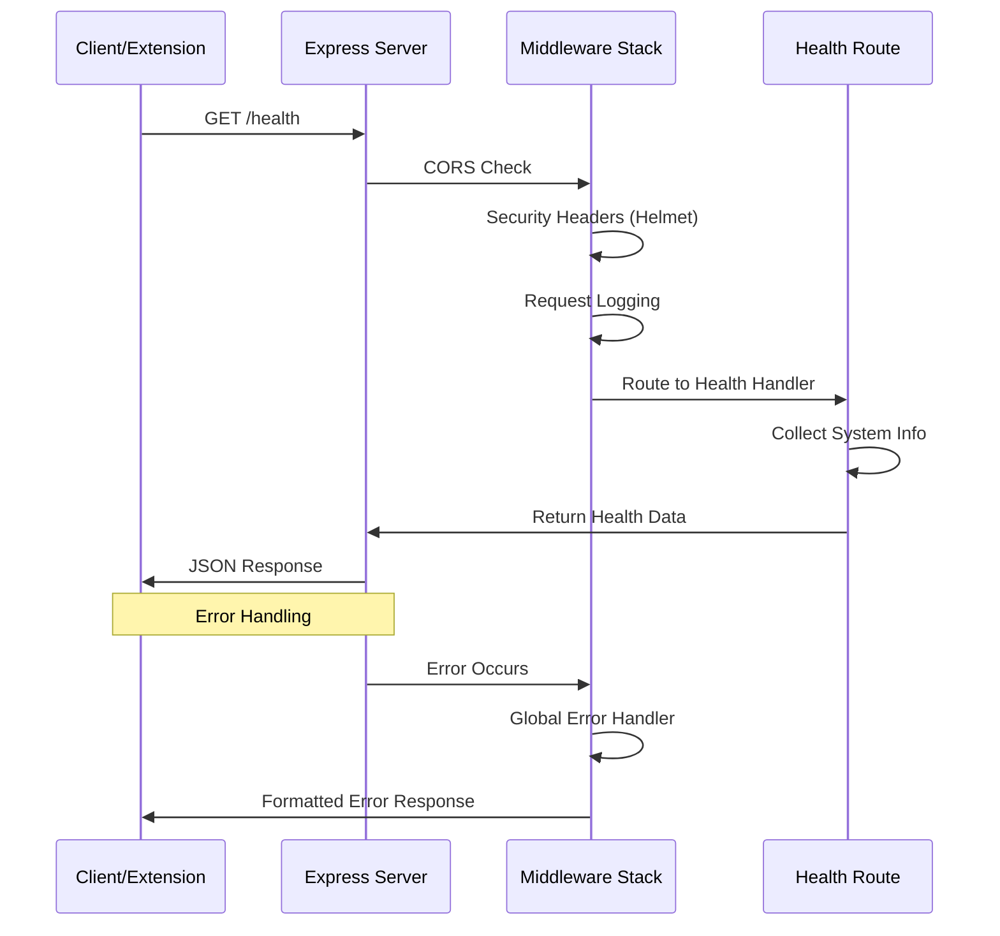

# Task 1.5 Implementation Plan: Express.js Server with Health Endpoint

## ✅ TASK COMPLETED

**Status**: ✅ Complete
**Testing**: Manual testing confirmed working as expected
**Build Status**: ✅ TypeScript compilation successful

### Implementation Summary
- Created production-ready Express.js server with comprehensive middleware stack
- Implemented health endpoint returning detailed system information
- Added CORS configuration for chrome-extension communication
- Set up global error handling with development/production modes
- Configured security headers with Helmet middleware
- Added request logging for development environment
- Implemented graceful shutdown handling with process signals

### Verification Results
- ✅ Server starts successfully on port 3000
- ✅ Health endpoint returns proper JSON: `{"status":"healthy","timestamp":"...","uptime":32,"version":"1.0.0","environment":"development","memory":{"used":"8.1 MB","total":"10.1 MB"}}`
- ✅ CORS headers configured correctly for chrome-extension origins
- ✅ Error handling works with proper 404 responses
- ✅ All middleware integration successful
- ✅ TypeScript builds without errors

## Overview
Set up a robust Express.js server foundation with proper middleware, error handling, and a health endpoint, following the established architecture patterns. This will complete Phase 1 and provide a solid foundation for Phase 2 AI integration.

## Objectives
1. Create a production-ready Express.js server with proper middleware setup
2. Implement a comprehensive health endpoint for monitoring
3. Establish proper project structure following the architecture
4. Add essential middleware (CORS, Helmet, error handling)
5. Set up proper logging and development workflow

## Architecture Overview



## Implementation Plan

### 1. Server Foundation Structure

**Files to Create:**
- [`server/src/index.ts`](server/src/index.ts) - Main server entry point
- [`server/src/app.ts`](server/src/app.ts) - Express app configuration
- [`server/src/routes/index.ts`](server/src/routes/index.ts) - Route aggregator
- [`server/src/routes/health.ts`](server/src/routes/health.ts) - Health endpoint
- [`server/src/middleware/index.ts`](server/src/middleware/index.ts) - Middleware exports
- [`server/src/middleware/error-handler.ts`](server/src/middleware/error-handler.ts) - Global error handling
- [`server/src/middleware/logger.ts`](server/src/middleware/logger.ts) - Request logging
- [`server/src/utils/index.ts`](server/src/utils/index.ts) - Utility functions
- [`server/src/types/index.ts`](server/src/types/index.ts) - Server type definitions

### 2. Core Server Configuration

**Main Server Setup ([`server/src/index.ts`](server/src/index.ts)):**
- Environment configuration
- Server startup and graceful shutdown
- Port configuration with fallbacks
- Process signal handling

**Express App Configuration ([`server/src/app.ts`](server/src/app.ts)):**
- Middleware stack setup
- Route registration
- Error handling middleware
- Security headers with Helmet

### 3. Middleware Stack

**Security & CORS:**
- Helmet for security headers
- CORS configuration for extension communication
- JSON body parser with size limits
- Request logging for development

**Error Handling:**
- Global error handler with proper HTTP status codes
- 404 handler for undefined routes
- Validation error formatting
- Development vs production error responses

### 4. Health Endpoint Implementation

**Comprehensive Health Check ([`server/src/routes/health.ts`](server/src/routes/health.ts)):**
```typescript
GET /health
{
  "status": "healthy",
  "timestamp": "2025-01-27T17:30:00.000Z",
  "uptime": 3600,
  "version": "1.0.0",
  "environment": "development",
  "memory": {
    "used": "45.2 MB",
    "total": "128 MB"
  }
}
```

### 5. Project Structure Implementation

```
server/src/
├── index.ts                 # Server entry point
├── app.ts                   # Express app configuration
├── routes/
│   ├── index.ts            # Route aggregator
│   └── health.ts           # Health endpoint
├── middleware/
│   ├── index.ts            # Middleware exports
│   ├── error-handler.ts    # Global error handling
│   └── logger.ts           # Request logging
├── utils/
│   └── index.ts            # Utility functions
└── types/
    └── index.ts            # Server type definitions
```

## Detailed Implementation Flow



## Technical Specifications

### 1. Middleware Configuration
```typescript
// CORS setup for extension communication
const corsOptions = {
  origin: ['chrome-extension://*'],
  methods: ['GET', 'POST'],
  allowedHeaders: ['Content-Type', 'Authorization']
};

// Helmet security configuration
const helmetOptions = {
  contentSecurityPolicy: false, // Allow extension communication
  crossOriginEmbedderPolicy: false
};
```

### 2. Health Endpoint Response Schema
```typescript
interface HealthResponse {
  status: 'healthy' | 'unhealthy';
  timestamp: string;
  uptime: number;
  version: string;
  environment: string;
  memory: {
    used: string;
    total: string;
  };
}
```

### 3. Error Response Schema
```typescript
interface ErrorResponse {
  error: {
    message: string;
    status: number;
    timestamp: string;
    path: string;
    details?: any; // Only in development
  };
}
```

## Development Workflow

### 1. Build & Development Scripts
- `npm run dev` - Development server with hot reload
- `npm run build` - TypeScript compilation
- `npm run start` - Production server
- `npm run test` - Run test suite

### 2. Environment Configuration
- Development: Detailed logging, error details
- Production: Minimal logging, sanitized errors
- Port configuration with environment variables

### 3. Testing Strategy
- Health endpoint functionality
- Middleware integration
- Error handling scenarios
- CORS configuration validation

## Success Criteria

- ✅ Express server starts successfully on configured port
- ✅ Health endpoint returns proper JSON response with system information
- ✅ CORS middleware allows extension communication
- ✅ Helmet security headers are properly configured
- ✅ Global error handling catches and formats errors appropriately
- ✅ Request logging works in development mode
- ✅ Server follows the established architecture patterns
- ✅ TypeScript compilation works without errors
- ✅ Development and production modes work correctly

## Integration Points for Phase 2

This foundation will support:
- **OpenAI Integration**: Service layer ready for AI services
- **Image Analysis Endpoint**: Route structure prepared for `/analyze` endpoint
- **Error Handling**: Robust error handling for API failures
- **Security**: CORS and security headers configured for extension communication

## Testing Approach

**Manual Testing:**
1. Start server with `npm run dev`
2. Test health endpoint: `curl http://localhost:3000/health`
3. Verify CORS headers with extension requests
4. Test error handling with invalid routes
5. Confirm graceful shutdown with Ctrl+C

**Automated Testing:**
- Unit tests for health endpoint
- Middleware integration tests
- Error handling scenarios
- CORS configuration validation

## Implementation Steps

### Phase 1: Core Server Setup
1. Create main server entry point with environment configuration
2. Set up Express app with basic middleware stack
3. Implement graceful shutdown handling

### Phase 2: Middleware Implementation
1. Create global error handler middleware
2. Set up request logging for development
3. Configure CORS and security headers

### Phase 3: Health Endpoint
1. Implement comprehensive health check route
2. Add system information collection
3. Test endpoint functionality

### Phase 4: Project Structure
1. Organize code into proper directory structure
2. Create utility functions and type definitions
3. Set up route aggregation system

### Phase 5: Testing & Validation
1. Test all middleware integration
2. Validate CORS configuration
3. Test error handling scenarios
4. Verify development and production modes

This implementation will complete Phase 1 and provide a solid, production-ready foundation for the PauseShop backend server, ready for Phase 2 AI integration.