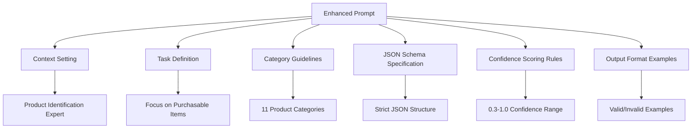
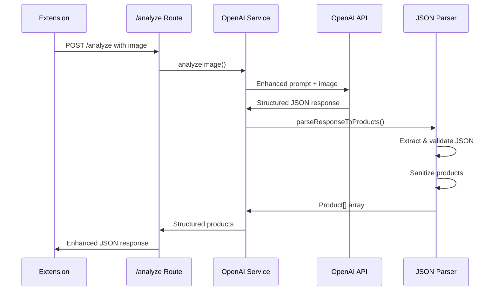

# Task 2.3 Implementation Plan: Enhanced Product Detection Prompt & JSON Response

## ✅ TASK COMPLETED

**Status**: ✅ Complete
**Testing**: Manual testing confirmed working as expected
**Build Status**: ✅ TypeScript compilation successful

## Overview
Transform the basic "What do you see in this image?" prompt into a sophisticated product detection system that returns structured JSON data with detailed product information suitable for Amazon search integration.

## Current State Analysis
- **Current Prompt**: [`server/src/prompts/product-analysis.txt`](server/src/prompts/product-analysis.txt:1) contains only "What do you see in this image?"
- **Current Response**: Unstructured text that requires complex parsing
- **Current Product Interface**: Only has `confidence` field in [`server/src/types/analyze.ts`](server/src/types/analyze.ts:21)
- **Current Parsing**: [`parseResponseToProducts()`](server/src/services/openai-service.ts:98) returns hardcoded response

## Phase 1: Prompt Engineering Strategy

### Prompt Engineering Architecture



### Enhanced Prompt Design

#### 1. Context and Role Definition
```
You are an expert product identification AI analyzing screenshots from streaming video content (Netflix, Hulu, etc.). Your task is to identify clearly visible, purchasable products that viewers might want to buy online.
```

#### 2. Product Categories Framework
```
FOCUS ON THESE PRODUCT CATEGORIES:
- clothing: shirts, pants, dresses, jackets, sweaters, etc.
- electronics: phones, laptops, headphones, TVs, tablets, etc.
- furniture: chairs, tables, sofas, beds, desks, etc.
- accessories: watches, jewelry, bags, belts, sunglasses, etc.
- footwear: shoes, boots, sneakers, sandals, heels, etc.
- home_decor: lamps, artwork, vases, pillows, curtains, etc.
- books_media: books, magazines, DVDs, games, etc.
- sports_fitness: equipment, gear, athletic wear, etc.
- beauty_personal_care: cosmetics, skincare, grooming tools, etc.
- kitchen_dining: cookware, utensils, appliances, etc.
- other: any other clearly identifiable purchasable product
```

#### 3. Identification Guidelines
```
IDENTIFICATION RULES:
1. Only include products that are clearly visible and identifiable
2. Focus on items that could realistically be purchased online
3. Ignore people, backgrounds, and non-purchasable elements
4. Prioritize items that are prominently featured or in focus
5. Include brand names or distinctive features when visible
```

#### 4. Confidence Scoring Framework
```
CONFIDENCE SCORING (0.3-1.0):
- 0.9-1.0: Product is clearly visible, easily identifiable, brand/details visible
- 0.7-0.8: Product is visible and identifiable, some details unclear
- 0.5-0.6: Product is partially visible or identification is somewhat uncertain
- 0.3-0.4: Product might be present but details are very unclear
- Below 0.3: Do not include the product
```

#### 5. Complete Enhanced Prompt

```
You are an expert product identification AI analyzing screenshots from streaming video content (Netflix, Hulu, etc.). Your task is to identify clearly visible, purchasable products that viewers might want to buy online.

FOCUS ON THESE PRODUCT CATEGORIES:
- clothing: shirts, pants, dresses, jackets, sweaters, etc.
- electronics: phones, laptops, headphones, TVs, tablets, etc.
- furniture: chairs, tables, sofas, beds, desks, etc.
- accessories: watches, jewelry, bags, belts, sunglasses, etc.
- footwear: shoes, boots, sneakers, sandals, heels, etc.
- home_decor: lamps, artwork, vases, pillows, curtains, etc.
- books_media: books, magazines, DVDs, games, etc.
- sports_fitness: equipment, gear, athletic wear, etc.
- beauty_personal_care: cosmetics, skincare, grooming tools, etc.
- kitchen_dining: cookware, utensils, appliances, etc.
- other: any other clearly identifiable purchasable product

FOCUS ON THESE TARGET GENDER TYPES:
- MEN
- WOMEN
- UNISEX
- BOY
- GIRL

CRITICAL IDENTIFICATION GUIDELINES:
- SEPARATE ITEMS: Identify each distinct piece of clothing/accessory as its own product entry
- SINGLE ITEMS WITH MULTIPLE COLORS: Treat multi-colored single items as ONE product (include all visible colors)
- COLOR IS CRITICAL: Always identify and include the primary color of items
- Be specific with colors (e.g., "navy blue" not just "blue", "forest green" not just "green")
- Include ALL visible colors in the product name and search terms for multi-colored items
- For clothing: If you see a man wearing clothing, identify it as "men's" clothing
- For clothing: If you see a woman wearing clothing, identify it as "women's" clothing
- For clothing: If you see a child wearing clothing, identify it as "children's" clothing
- Only mark as "unisex" if the item is truly gender-neutral
- Search terms should follow this pattern: "[gender] [colors] [product type] [material/style]"
- Examples: "men's navy blue cotton shorts", "women's black tank top with green accents", "red wireless headphones"
- DO NOT combine multiple distinct clothing items into one product description
- DO NOT split single items with multiple colors into separate products

BASIC IDENTIFICATION RULES:
1. Only include products that are clearly visible and identifiable
2. Focus on items that could realistically be purchased online
3. Ignore people, backgrounds, and non-purchasable elements
4. Prioritize items that are prominently featured or in focus
5. Include brand names or distinctive features when visible

CONFIDENCE SCORING (0.3-1.0):
- 0.9-1.0: Product is clearly visible, easily identifiable, brand/details visible
- 0.7-0.8: Product is visible and identifiable, some details unclear
- 0.5-0.6: Product is partially visible or identification is somewhat uncertain
- 0.3-0.4: Product might be present but details are very unclear
- Below 0.3: Do not include the product

REQUIRED JSON FORMAT (respond with ONLY this JSON, no other text):
{
  "products": [
    {
      "name": "product name",
      "category": "category_from_list_above",
      "description": "Detailed description suitable for online shopping search",
      "brand": "brand name or unknown",
      "primaryColor": "main color",
      "secondaryColors": ["color1", "color2"],
      "features": ["style", "material", "pattern"],
      "targetGender": "targetGender_from_list_above",
      "confidence": 0.85,
      "searchTerms": "optimized search terms for finding this product"
    }
  ]
}

If no clearly identifiable products are visible, return: {"products": []}

Analyze the image and return the JSON response:
```

## Phase 2: Technical Implementation Plan

### 1. Enhanced Type Definitions

#### Update Product Interface
**Modify**: [`server/src/types/analyze.ts`](server/src/types/analyze.ts:21)

```typescript
export interface Product {
  name: string;
  category: ProductCategory;
  description: string;
  brand: string;
  primaryColor: string;
  secondaryColors: string[];
  features: string[];
  targetGender: TargetGender;
  confidence: number;
  searchTerms: string;
}

export enum ProductCategory {
  CLOTHING = 'clothing',
  ELECTRONICS = 'electronics',
  FURNITURE = 'furniture',
  ACCESSORIES = 'accessories',
  FOOTWEAR = 'footwear',
  HOME_DECOR = 'home_decor',
  BOOKS_MEDIA = 'books_media',
  SPORTS_FITNESS = 'sports_fitness',
  BEAUTY_PERSONAL_CARE = 'beauty_personal_care',
  KITCHEN_DINING = 'kitchen_dining',
  OTHER = 'other'
}

export enum TargetGender {
  MEN = "men",
  WOMEN = "women",
  UNISEX = "unisex",
  BOY = "boy",
  GIRL = "girl",
}


export interface OpenAIProductResponse {
  products: Product[];
}
```

### 2. Enhanced JSON Parsing Logic

#### Update OpenAI Service
**Modify**: [`server/src/services/openai-service.ts`](server/src/services/openai-service.ts:98)

**Key Methods to Implement**:
```typescript
parseResponseToProducts(response: string): Product[] {
  try {
    // Clean the response - remove any non-JSON content
    const cleanedResponse = this.extractJSONFromResponse(response);
    
    // Parse JSON
    const parsedResponse: OpenAIProductResponse = JSON.parse(cleanedResponse);
    
    // Validate and sanitize products
    return this.validateAndSanitizeProducts(parsedResponse.products || []);
    
  } catch (error) {
    console.error('[OPENAI_SERVICE] Error parsing response:', error);
    console.log('[OPENAI_SERVICE] Raw response:', response);
    return [];
  }
}

private extractJSONFromResponse(response: string): string {
  // Remove any text before the first {
  const jsonStart = response.indexOf('{');
  if (jsonStart === -1) throw new Error('No JSON found in response');
  
  // Find the last } to handle any trailing text
  const jsonEnd = response.lastIndexOf('}');
  if (jsonEnd === -1) throw new Error('Incomplete JSON in response');
  
  return response.substring(jsonStart, jsonEnd + 1);
}

private validateAndSanitizeProducts(products: any[]): Product[] {
  return products
    .filter(product => this.isValidProduct(product))
    .map(product => this.sanitizeProduct(product))
    .filter(product => product.confidence >= 0.3);
}

private isValidProduct(product: any): boolean {
  return (
    typeof product === 'object' &&
    typeof product.id === 'string' &&
    typeof product.category === 'string' &&
    typeof product.name === 'string' &&
    typeof product.description === 'string' &&
    typeof product.confidence === 'number' &&
    product.confidence >= 0 && product.confidence <= 1
  );
}

private sanitizeProduct(product: any): Product {
  return {
    id: String(product.id).substring(0, 50),
    category: this.validateCategory(product.category),
    name: String(product.name).substring(0, 100),
    description: String(product.description).substring(0, 500),
    confidence: Math.max(0, Math.min(1, Number(product.confidence))),
    attributes: this.sanitizeAttributes(product.attributes)
  };
}

private validateCategory(category: string): ProductCategory {
  const validCategories = Object.values(ProductCategory);
  return validCategories.includes(category as ProductCategory) 
    ? category as ProductCategory 
    : ProductCategory.OTHER;
}

private sanitizeAttributes(attributes: any): ProductAttributes | undefined {
  if (!attributes || typeof attributes !== 'object') return undefined;
  
  const sanitized: ProductAttributes = {};
  
  if (Array.isArray(attributes.color)) {
    sanitized.color = attributes.color.slice(0, 3).map((c: any) => String(c).substring(0, 20));
  }
  if (typeof attributes.material === 'string') {
    sanitized.material = attributes.material.substring(0, 50);
  }
  if (typeof attributes.brand === 'string') {
    sanitized.brand = attributes.brand.substring(0, 50);
  }
  if (typeof attributes.style === 'string') {
    sanitized.style = attributes.style.substring(0, 50);
  }
  if (typeof attributes.type === 'string') {
    sanitized.type = attributes.type.substring(0, 50);
  }
  
  return Object.keys(sanitized).length > 0 ? sanitized : undefined;
}
```

### 3. Error Handling Enhancement

#### Add JSON Parsing Error Handling
```typescript
// Add to OpenAI Service error handling
private handleParsingError(error: any, response: string): Product[] {
  console.error('[OPENAI_SERVICE] JSON parsing failed:', error.message);
  console.log('[OPENAI_SERVICE] Response that failed to parse:', response.substring(0, 200));
  
  // Attempt fallback parsing for common issues
  try {
    return this.attemptFallbackParsing(response);
  } catch (fallbackError) {
    console.error('[OPENAI_SERVICE] Fallback parsing also failed');
    return [];
  }
}

private attemptFallbackParsing(response: string): Product[] {
  // Try to fix common JSON issues
  let fixedResponse = response
    .replace(/,\s*}/g, '}')  // Remove trailing commas
    .replace(/,\s*]/g, ']')  // Remove trailing commas in arrays
    .replace(/'/g, '"');     // Replace single quotes with double quotes
  
  const parsedResponse: OpenAIProductResponse = JSON.parse(fixedResponse);
  return this.validateAndSanitizeProducts(parsedResponse.products || []);
}
```

## Implementation Flow



## Implementation Steps

### Step 1: Update the Prompt File
1. Replace [`server/src/prompts/product-analysis.txt`](server/src/prompts/product-analysis.txt:1) with the enhanced prompt
2. Test prompt effectiveness with sample images

### Step 2: Enhance Type Definitions
1. Update [`server/src/types/analyze.ts`](server/src/types/analyze.ts:21) with comprehensive Product interface
2. Add ProductCategory enum and ProductAttributes interface
3. Add OpenAIProductResponse interface

### Step 3: Implement Enhanced JSON Parsing
1. Replace [`parseResponseToProducts()`](server/src/services/openai-service.ts:98) in [`server/src/services/openai-service.ts`](server/src/services/openai-service.ts:98)
2. Add JSON extraction and validation methods
3. Implement comprehensive error handling

### Step 4: Testing and Validation
1. Test with various screenshot types (clothing, electronics, furniture)
2. Validate JSON parsing with malformed responses
3. Test confidence scoring accuracy
4. Verify category classification

## File Structure Changes

```
server/src/
├── prompts/
│   └── product-analysis.txt     # Modified: Enhanced prompt
├── types/
│   └── analyze.ts               # Modified: Enhanced Product interface
├── services/
│   └── openai-service.ts        # Modified: Enhanced JSON parsing
```

## Success Criteria

- ✅ Enhanced prompt returns structured JSON responses
- ✅ Product interface includes name, category, features and more
- ✅ JSON parsing handles malformed responses gracefully
- ✅ Product categories are properly validated and classified
- ✅ Confidence scoring follows defined guidelines (0.3-1.0)
- ✅ Attributes are properly extracted and sanitized
- ✅ Error handling provides meaningful feedback for debugging
- ✅ Response format is ready for Amazon search integration

## Testing Strategy

### Manual Testing Checklist
1. **Prompt Effectiveness**
   - [ ] Test with clothing items (shirts, pants, dresses)
   - [ ] Test with electronics (phones, laptops, headphones)
   - [ ] Test with furniture (chairs, tables, sofas)
   - [ ] Test with accessories (watches, bags, jewelry)
   - [ ] Test with empty/no product images

2. **JSON Parsing**
   - [ ] Test with valid JSON responses
   - [ ] Test with malformed JSON (trailing commas, single quotes)
   - [ ] Test with responses containing extra text
   - [ ] Test with completely invalid responses

3. **Product Validation**
   - [ ] Verify confidence scores are within 0.3-1.0 range
   - [ ] Check category validation and fallback to "other"
   - [ ] Test attribute sanitization and length limits
   - [ ] Verify product filtering (confidence < 0.3 excluded)

4. **Error Handling**
   - [ ] Test with network failures
   - [ ] Test with OpenAI API errors
   - [ ] Test with JSON parsing failures
   - [ ] Verify fallback parsing mechanisms

## Future Integration Points

This enhanced prompt and parsing system provides the foundation for:
- **Task 2.4**: Response interpretation and processing
- **Phase 3**: Amazon search integration using structured product data
- **Phase 4**: UI display of categorized products with detailed information

The structured JSON format will enable precise Amazon searches using product names, descriptions, and attributes, significantly improving the accuracy of product matching.

## Benefits

### For Amazon Search Integration
- **Precise Search Terms**: Detailed descriptions enable accurate product searches
- **Category Filtering**: Product categories help narrow Amazon search results
- **Attribute Matching**: Color, material, brand information improves search relevance
- **Confidence-Based Prioritization**: Higher confidence products get priority in search

### For User Experience
- **Relevant Results**: Better product identification leads to more relevant suggestions
- **Detailed Information**: Rich product data provides better context for users
- **Quality Control**: Confidence scoring ensures only clear products are suggested
- **Categorized Display**: Products can be grouped by category for better organization

This implementation transforms the basic image analysis into a sophisticated product detection system ready for e-commerce integration.
