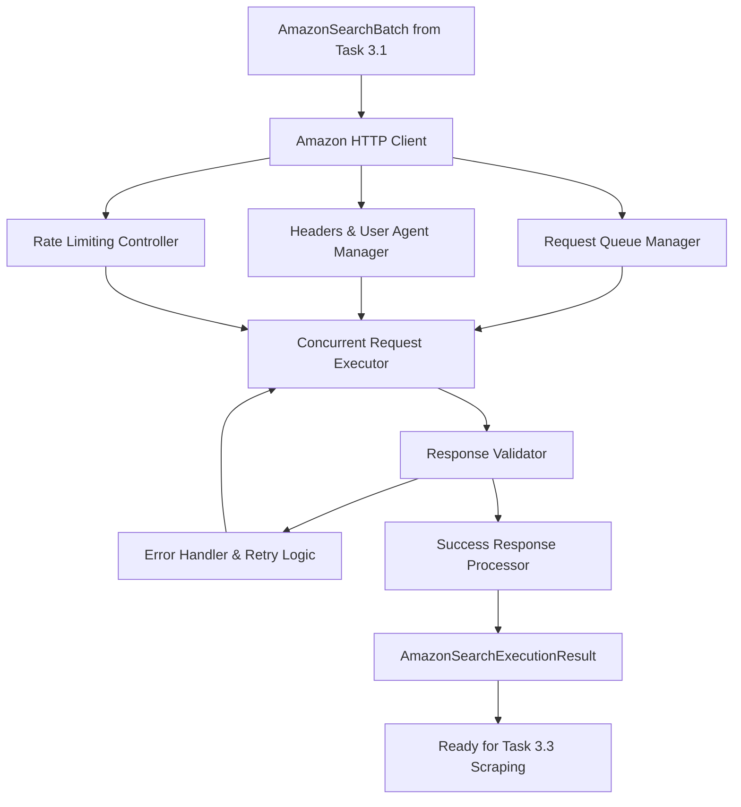

# Task 3.2 Implementation Plan: Amazon Search Execution

## Overview

Task 3.2 involves implementing the actual HTTP request functionality to fetch Amazon search results using the URLs constructed in Task 3.1. This will leverage Chrome extension permissions to bypass CORS and make direct requests with full control over headers and user agents.

## Current Context Analysis

### What's Already Built
- ✅ **Task 3.1**: [`amazon-search.ts`](../../extension/src/scraper/amazon-search.ts:1) constructs Amazon search URLs
- ✅ **Integration**: [`analysis-workflow.ts`](../../extension/src/background/analysis-workflow.ts:53) calls [`constructAmazonSearchBatch()`](../../extension/src/scraper/amazon-search.ts:222)
- ✅ **Data Flow**: Products → Analysis → Search URLs → **[TASK 3.2 INSERTION POINT]** → Raw HTML → Task 3.3 Scraping

### Current Data Structures
- [`AmazonSearchResult[]`](../../extension/src/types/amazon.ts:50) contains constructed URLs
- [`AmazonSearchBatch`](../../extension/src/types/amazon.ts:65) provides metadata and configuration
- Ready for HTTP execution layer

## Architecture Design



## Implementation Strategy

### 1. Chrome Extension Permissions Setup

**File**: [`extension/manifest.json`](../../extension/manifest.json:1)

Add required permissions:
```json
{
  "permissions": [
    "https://www.amazon.com/*",
    "https://amazon.com/*",
    "https://www.amazon.co.uk/*",
    "https://amazon.co.uk/*"
  ]
}
```

### 2. Amazon HTTP Client Module

**File**: [`extension/src/scraper/amazon-http-client.ts`](../../extension/src/scraper/amazon-http-client.ts:1)

Core responsibilities:
- Execute HTTP requests to Amazon search URLs
- Manage realistic browser headers and user agents
- Handle rate limiting and request throttling
- Implement retry logic for failed requests
- Validate and process responses

### 3. Request Management System

**Components**:
- **Request Queue**: Manage concurrent requests with proper throttling
- **User Agent Rotation**: Realistic browser identification
- **Header Management**: Proper HTTP headers to avoid detection
- **Rate Limiting**: Prevent overwhelming Amazon servers

## Implementation Components

### Type Definitions

**File**: [`extension/src/types/amazon.ts`](../../extension/src/types/amazon.ts:1) (extend existing)

```typescript
interface AmazonHttpConfig {
  maxConcurrentRequests: number;
  requestDelayMs: number;
  timeoutMs: number;
  maxRetries: number;
  userAgentRotation: boolean;
}

interface AmazonSearchExecutionResult {
  productId: string;
  searchUrl: string;
  success: boolean;
  htmlContent?: string;
  error?: string;
  statusCode?: number;
  responseTime: number;
  retryCount: number;
}

interface AmazonSearchExecutionBatch {
  executionResults: AmazonSearchExecutionResult[];
  config: AmazonHttpConfig;
  metadata: {
    totalRequests: number;
    successfulRequests: number;
    failedRequests: number;
    totalExecutionTime: number;
    averageResponseTime: number;
  };
}
```

### Core Functions

1. [`executeAmazonSearchBatch(searchBatch: AmazonSearchBatch, config?: Partial<AmazonHttpConfig>): Promise<AmazonSearchExecutionBatch>`](../../extension/src/scraper/amazon-http-client.ts:1)
2. [`executeAmazonSearch(searchResult: AmazonSearchResult, config: AmazonHttpConfig): Promise<AmazonSearchExecutionResult>`](../../extension/src/scraper/amazon-http-client.ts:1)
3. [`generateRealisticHeaders(url: string): Headers`](../../extension/src/scraper/amazon-http-client.ts:1)
4. [`handleRateLimit(requestCount: number, config: AmazonHttpConfig): Promise<void>`](../../extension/src/scraper/amazon-http-client.ts:1)

### Request Strategy

**Headers Strategy**:
```typescript
const REALISTIC_HEADERS = {
  'User-Agent': 'Mozilla/5.0 (Windows NT 10.0; Win64; x64) AppleWebKit/537.36 (KHTML, like Gecko) Chrome/120.0.0.0 Safari/537.36',
  'Accept': 'text/html,application/xhtml+xml,application/xml;q=0.9,image/webp,*/*;q=0.8',
  'Accept-Language': 'en-US,en;q=0.5',
  'Accept-Encoding': 'gzip, deflate, br',
  'DNT': '1',
  'Connection': 'keep-alive',
  'Upgrade-Insecure-Requests': '1'
};
```

**Rate Limiting Strategy**:
- Maximum 3 concurrent requests
- 1-2 second delay between requests
- Exponential backoff for retries
- Circuit breaker for repeated failures

## Integration Points

### Current Integration
Modify [`analysis-workflow.ts`](../../extension/src/background/analysis-workflow.ts:53) to:
1. Take existing [`amazonSearchResults`](../../extension/src/background/analysis-workflow.ts:53)
2. Execute HTTP requests using new client
3. Return both search URLs AND fetched HTML content

### Updated Workflow
```typescript
// In analysis-workflow.ts
const amazonSearchResults = constructAmazonSearchBatch(products, config);
const amazonExecutionResults = await executeAmazonSearchBatch(amazonSearchResults);

return {
  success: true,
  analysisResult,
  amazonSearchResults,
  amazonExecutionResults  // NEW: Raw HTML content for Task 3.3
};
```

## Error Handling & Resilience

### Error Categories
1. **Network Errors**: Connection timeouts, DNS failures
2. **HTTP Errors**: 4xx/5xx status codes, rate limiting
3. **Amazon Blocking**: CAPTCHA, IP blocking, bot detection
4. **Content Errors**: Invalid HTML, unexpected responses

### Fallback Strategies
1. **Retry Logic**: Exponential backoff with jitter
2. **User Agent Rotation**: Switch user agents on failures
3. **Request Spacing**: Increase delays on repeated failures
4. **Graceful Degradation**: Continue with successful requests even if some fail

## Performance Considerations

### Optimization Strategies
- **Concurrent Processing**: Execute multiple requests simultaneously (with limits)
- **Request Pooling**: Reuse connections where possible
- **Response Streaming**: Handle large HTML responses efficiently
- **Memory Management**: Clean up responses after processing

### Monitoring & Metrics
- Track success/failure rates
- Monitor response times
- Detect rate limiting patterns
- Log unusual response patterns

## Security & Detection Avoidance

### Anti-Detection Measures
- **Realistic Headers**: Mimic genuine browser requests
- **Request Timing**: Human-like request patterns
- **User Agent Rotation**: Avoid consistent fingerprinting
- **Error Handling**: Graceful handling of blocking attempts

### Privacy Considerations
- No persistent storage of Amazon HTML content
- Minimal logging of request details
- Respect Amazon's robots.txt (where reasonable)

## Testing Strategy

### Unit Tests
- Test HTTP client with mock responses
- Validate header generation
- Test rate limiting logic
- Test retry mechanisms

### Integration Tests
- Test with real Amazon URLs (limited)
- Validate response processing
- Test error handling scenarios

### Manual Testing Requirements
⚠️ **Important**: Extension testing requires manual verification
- Test with actual Amazon search URLs
- Verify CORS bypass functionality
- Check for blocking/CAPTCHA responses
- Validate HTML content quality

## Configuration & Flexibility

### Default Configuration
```typescript
const DEFAULT_HTTP_CONFIG: AmazonHttpConfig = {
  maxConcurrentRequests: 3,
  requestDelayMs: 1500,
  timeoutMs: 10000,
  maxRetries: 2,
  userAgentRotation: true
};
```

### Extensibility
- Support for different Amazon domains
- Configurable request patterns
- Pluggable retry strategies
- Customizable header sets

## Deliverables

1. **[`extension/src/scraper/amazon-http-client.ts`](../../extension/src/scraper/amazon-http-client.ts:1)** - Main HTTP execution module
2. **Updated [`extension/src/types/amazon.ts`](../../extension/src/types/amazon.ts:1)** - Extended type definitions
3. **Updated [`extension/manifest.json`](../../extension/manifest.json:1)** - Required permissions
4. **Updated [`extension/src/background/analysis-workflow.ts`](../../extension/src/background/analysis-workflow.ts:1)** - Integration with HTTP client
5. **Unit tests** - Comprehensive test coverage
6. **Documentation** - API documentation and usage examples

## Success Criteria

✅ **Functional**: Successfully fetch Amazon search result HTML pages  
✅ **Reliable**: Handle network errors and Amazon blocking gracefully  
✅ **Performant**: Execute multiple searches efficiently without blocking  
✅ **Stealthy**: Avoid detection while respecting reasonable rate limits  
✅ **Integrated**: Seamlessly integrate with existing Task 3.1 output  

## Implementation Steps

1. Add required permissions to [`manifest.json`](../../extension/manifest.json:1)
2. Extend [`amazon.ts`](../../extension/src/types/amazon.ts:1) with execution types
3. Implement [`amazon-http-client.ts`](../../extension/src/scraper/amazon-http-client.ts:1) core module
4. Add realistic headers and user agent management
5. Implement rate limiting and retry logic
6. Integrate with [`analysis-workflow.ts`](../../extension/src/background/analysis-workflow.ts:1)
7. Create comprehensive unit tests
8. Test integration with existing workflow

## Risk Mitigation

### Amazon Blocking Risks
- **Mitigation**: Realistic request patterns, proper rate limiting
- **Fallback**: Graceful degradation, retry with different parameters

### Performance Risks
- **Mitigation**: Concurrent request limits, timeout handling
- **Fallback**: Sequential processing if concurrent fails

### Extension Permission Risks
- **Mitigation**: Minimal required permissions, clear documentation
- **Fallback**: Server-side proxy option for future consideration

This plan builds directly on Task 3.1's URL construction and prepares the raw HTML content that Task 3.3 will scrape for product information. The implementation focuses on reliability, stealth, and integration with the existing architecture.