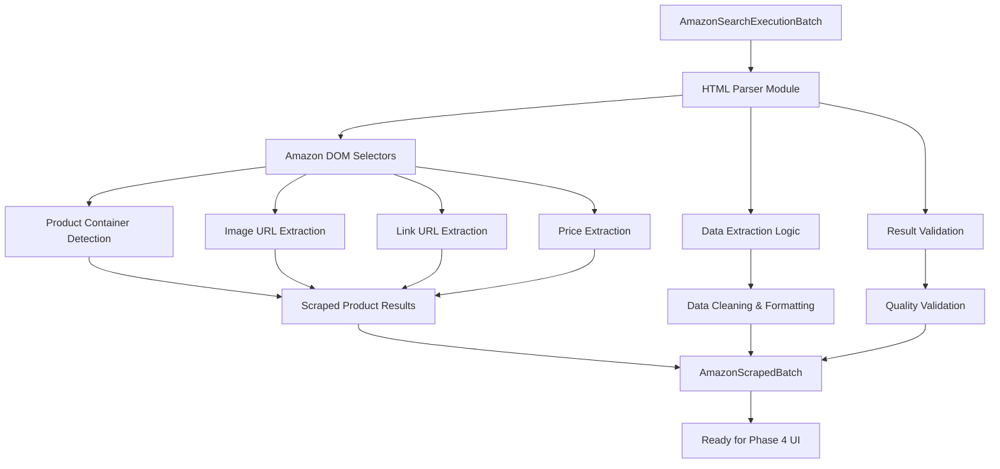

# Task 3.3 Implementation Plan: Amazon Search Result Scraping

## Overview

Task 3.3 involves scraping the Amazon search results HTML (fetched in Task 3.2) to extract the top 5 product results with their thumbnail images, product page URLs, and prices. This is the final step in Phase 3 (Amazon Integration) and will provide the structured product data needed for Phase 4 (UI Development).

## Current Context Analysis

### Data Flow Status
```
✅ Screenshot Capture (when video pauses)
✅ OpenAI Analysis (detect products) 
✅ Task 3.1: Amazon Search URL Construction
✅ Task 3.2: HTTP Request Execution
🔄 Task 3.3: HTML Content Scraping ← [CURRENT TASK]
```

### Available Input Data
From Task 3.2, we have [`AmazonSearchExecutionBatch`](../../extension/src/types/amazon.ts:132) containing:
- [`executionResults[]`](../../extension/src/types/amazon.ts:134) with raw HTML content
- Original product tracking through [`productId`](../../extension/src/types/amazon.ts:110) fields
- Success/failure status for each search request

### Target Output Data
For each detected product from OpenAI analysis, extract up to 5 Amazon results with:
- **Thumbnail Image URL**: Product image for UI display
- **Product Page URL**: Direct link to Amazon product page
- **Price**: Current product price (formatted)

**Data Organization**: Organize by detected product, with up to 5 Amazon results per detected product for the expandable UI (vertical display with horizontal expansion).

## Architecture Design



## Implementation Strategy

### 1. Create Amazon HTML Parser Module

**File**: [`extension/src/scraper/amazon-parser.ts`](../../extension/src/scraper/amazon-parser.ts:1)

This module will:
- Parse Amazon search results HTML using DOM manipulation
- Extract product data using CSS selectors and fallback strategies
- Handle Amazon's dynamic HTML structure variations
- Validate and clean extracted data
- Maintain product tracking through original [`productId`](../../extension/src/types/amazon.ts:110) fields

### 2. Amazon DOM Selector Strategy

Amazon search results follow these patterns:
```html
<!-- Main product container -->
<div data-component-type="s-search-result" data-asin="[PRODUCT_ID]">
  <!-- Product image -->
  
  
  <!-- Product link -->
  <a class="a-link-normal" href="[PRODUCT_PATH]">
    
  <!-- Price container -->
  <span class="a-price-whole">$XX</span>
  <span class="a-price-fraction">XX</span>
</div>
```

**Primary Selectors**:
- Product containers: `[data-component-type="s-search-result"]`
- Thumbnail images: `.s-image`, `img[data-image-latency]`
- Product links: `h2 a`, `.a-link-normal`
- Prices: `.a-price-whole`, `.a-price`, `.a-offscreen`

**Fallback Selectors** (for layout variations):
- Alternative containers: `[data-asin]`, `.s-result-item`
- Alternative images: `img[src*="images-amazon"]`
- Alternative links: `a[href*="/dp/"]`, `a[href*="/gp/product/"]`

### 3. Type Definitions Extension

**File**: [`extension/src/types/amazon.ts`](../../extension/src/types/amazon.ts:145) (extend existing)

```typescript
interface AmazonScrapedProduct {
  productId: string;           // From original search result
  amazonAsin?: string;         // Amazon product identifier
  thumbnailUrl: string;        // Product image URL
  productUrl: string;          // Full Amazon product page URL
  price: string;               // Formatted price string
  priceValue?: number;         // Numeric price value for sorting
  position: number;            // Position in search results (1-5)
  confidence: number;          // Confidence in scraped data quality
}

interface AmazonScrapedResult {
  productId: string;           // Original product from OpenAI analysis
  searchUrl: string;           // Amazon search URL used
  success: boolean;            // Whether scraping was successful
  products: AmazonScrapedProduct[];  // Up to 5 scraped products
  error?: string;              // Error message if failed
  scrapingTime: number;        // Time taken to scrape
  originalSearchResult: AmazonSearchResult;
  originalExecutionResult: AmazonSearchExecutionResult;
}

interface AmazonScrapedBatch {
  scrapedResults: AmazonScrapedResult[];
  metadata: {
    totalSearches: number;
    successfulScrapes: number;
    failedScrapes: number;
    totalProductsFound: number;
    averageProductsPerSearch: number;
    totalScrapingTime: number;
  };
}
```

## Implementation Components

### Core Functions

1. **[`parseAmazonSearchHtml(htmlContent: string): AmazonScrapedProduct[]`](../../extension/src/scraper/amazon-parser.ts:1)**
   - Parse HTML and extract product data
   - Return up to 5 products in search result order

2. **[`extractProductData(productElement: Element): AmazonScrapedProduct | null`](../../extension/src/scraper/amazon-parser.ts:1)**
   - Extract data from individual product DOM element
   - Handle missing or malformed data gracefully

3. **[`validateScrapedProduct(product: AmazonScrapedProduct): boolean`](../../extension/src/scraper/amazon-parser.ts:1)**
   - Validate required fields are present and valid
   - Check URL formats and image accessibility

4. **[`scrapeAmazonSearchBatch(executionBatch: AmazonSearchExecutionBatch): AmazonScrapedBatch`](../../extension/src/scraper/amazon-parser.ts:1)**
   - Process entire batch of execution results
   - Maintain product tracking and metadata

### Data Extraction Logic

#### Thumbnail Image URL Extraction
```typescript
const extractThumbnailUrl = (container: Element): string | null => {
  // Primary selector
  const img = container.querySelector('.s-image') as HTMLImageElement;
  if (img?.src) return img.src;
  
  // Fallback selectors
  const fallbackImg = container.querySelector('img[data-image-latency], img[src*="images-amazon"]') as HTMLImageElement;
  if (fallbackImg?.src) return fallbackImg.src;
  
  return null;
};
```

#### Product URL Extraction
```typescript
const extractProductUrl = (container: Element, baseUrl: string): string | null => {
  // Primary selector
  const link = container.querySelector('h2 a, .a-link-normal') as HTMLAnchorElement;
  if (link?.href) return new URL(link.href, baseUrl).href;
  
  // Fallback: look for any Amazon product link
  const fallbackLink = container.querySelector('a[href*="/dp/"], a[href*="/gp/product/"]') as HTMLAnchorElement;
  if (fallbackLink?.href) return new URL(fallbackLink.href, baseUrl).href;
  
  return null;
};
```

#### Price Extraction
```typescript
const extractPrice = (container: Element): { price: string; priceValue?: number } => {
  // Try whole + fraction format
  const whole = container.querySelector('.a-price-whole')?.textContent?.trim();
  const fraction = container.querySelector('.a-price-fraction')?.textContent?.trim();
  
  if (whole) {
    const price = fraction ? `$${whole}.${fraction}` : `$${whole}`;
    const priceValue = parseFloat(whole + (fraction ? `.${fraction}` : ''));
    return { price, priceValue };
  }
  
  // Try single price element
  const singlePrice = container.querySelector('.a-price .a-offscreen')?.textContent?.trim();
  if (singlePrice) {
    const priceValue = parseFloat(singlePrice.replace(/[^0-9.]/g, ''));
    return { price: singlePrice, priceValue };
  }
  
  return { price: 'Price not available' };
};
```

## Error Handling & Fallbacks

### HTML Parsing Errors
1. **Invalid HTML**: Use DOMParser with error handling
2. **Missing Elements**: Graceful degradation with partial data
3. **Changed Selectors**: Multiple fallback selector strategies
4. **Empty Results**: Return empty array with diagnostic info

### Data Validation
1. **Invalid URLs**: Validate and construct absolute URLs
2. **Missing Images**: Provide placeholder or skip product
3. **Price Parsing**: Handle various price formats and currencies
4. **Duplicate Products**: Filter by ASIN or URL uniqueness

## Integration Points

### Current Integration
Extend [`analysis-workflow.ts`](../../extension/src/background/analysis-workflow.ts:62) to:
1. Import the new Amazon parser module
2. Process execution results through HTML scraping
3. Return both execution results AND scraped product data

### Workflow Integration
```typescript
// Step 6: Scrape Amazon search results HTML
try {
  log(config, 'Scraping Amazon search results...');
  const amazonScrapedResults = scrapeAmazonSearchBatch(amazonExecutionResults);
  
  log(config, `Amazon scraping complete: ${amazonScrapedResults.metadata.totalProductsFound} products found`);
  
  return {
    success: true,
    analysisResult,
    amazonSearchResults,
    amazonExecutionResults,
    amazonScrapedResults
  };
} catch (scrapingError) {
  // Handle scraping errors gracefully
}
```

## Performance Considerations

### Efficient DOM Parsing
- **Lightweight Parsing**: Use native DOMParser for HTML processing
- **Selective Querying**: Only parse necessary DOM sections
- **Batch Processing**: Process multiple search results efficiently
- **Memory Management**: Clean up DOM references after processing

### Caching Strategy
- **Selector Caching**: Cache successful selector patterns
- **Result Validation**: Pre-validate data before expensive operations
- **Error Recovery**: Quick fallback to alternative extraction methods

## Testing Strategy

### Unit Tests
**File**: [`extension/tests/amazon-parser.test.ts`](../../extension/tests/amazon-parser.test.ts:1)

- Test HTML parsing with real Amazon search result samples
- Test selector fallback mechanisms
- Test data validation and cleaning
- Test error handling for malformed HTML

### Integration Tests
- Test with real execution results from Task 3.2
- Verify product tracking through the entire pipeline
- Test batch processing performance

### Mock Data
Create sample Amazon HTML files for consistent testing:
- **`tests/fixtures/amazon-search-sample.html`** - Typical search results
- **`tests/fixtures/amazon-search-minimal.html`** - Minimal product data
- **`tests/fixtures/amazon-search-empty.html`** - No results page

## Configuration & Flexibility

### Parser Configuration
```typescript
interface AmazonParserConfig {
  maxProductsPerSearch: number;    // Default: 5
  requireThumbnail: boolean;       // Default: true
  requirePrice: boolean;           // Default: false
  validateUrls: boolean;           // Default: true
  timeoutMs: number;               // Default: 5000
}
```

### Extensibility
- **Selector Updates**: Easy to update selectors for Amazon layout changes
- **Data Fields**: Extensible to add more product fields in the future
- **Multiple Domains**: Support for different Amazon country domains

## Deliverables

1. **[`extension/src/scraper/amazon-parser.ts`](../../extension/src/scraper/amazon-parser.ts:1)** - Main HTML parsing module
2. **Extended [`extension/src/types/amazon.ts`](../../extension/src/types/amazon.ts:145)** - Scraping type definitions
3. **Updated [`extension/src/background/analysis-workflow.ts`](../../extension/src/background/analysis-workflow.ts:62)** - Integration with workflow
4. **Updated [`extension/src/background/types.ts`](../../extension/src/background/types.ts:21)** - Response type extensions
5. **[`extension/tests/amazon-parser.test.ts`](../../extension/tests/amazon-parser.test.ts:1)** - Comprehensive test suite
6. **[`extension/tests/fixtures/`](../../extension/tests/fixtures/)** - Sample HTML test data

## Success Criteria

✅ **Functional**: Successfully extract thumbnail URLs, product URLs, and prices from Amazon search results  
✅ **Robust**: Handle Amazon layout variations and missing data gracefully  
✅ **Performant**: Process multiple search results quickly without blocking  
✅ **Accurate**: Maintain correct product tracking and result ordering  
✅ **Testable**: Comprehensive test coverage with real Amazon HTML samples  

## Implementation Steps

1. Create [`extension/src/types/amazon.ts`](../../extension/src/types/amazon.ts:145) extensions for scraping types
2. Implement [`extension/src/scraper/amazon-parser.ts`](../../extension/src/scraper/amazon-parser.ts:1) core parsing module
3. Add DOM selector strategies with fallback mechanisms
4. Integrate with [`extension/src/background/analysis-workflow.ts`](../../extension/src/background/analysis-workflow.ts:62)
5. Update [`extension/src/background/types.ts`](../../extension/src/background/types.ts:21) response types
6. Create comprehensive test suite with real Amazon HTML samples
7. Test integration with existing Task 3.1 and 3.2 functionality

## Data Flow Completion

After Task 3.3, the complete workflow will be:

```
1. Screenshot Capture (when video pauses)
         ↓
2. OpenAI Analysis (detect products)
         ↓
3. Task 3.1: Amazon Search URL Construction
         ↓
4. Task 3.2: HTTP Request Execution
         ↓
5. Task 3.3: HTML Content Scraping ← [THIS TASK]
         ↓
6. Structured Product Data (ready for Phase 4 UI)
```

## Structured Product Data Format

The final output will be organized by detected product, with up to 5 Amazon results per detected product:

```typescript
// Example structure for UI consumption
{
  scrapedResults: [
    {
      productId: "detected-product-1",
      products: [
        { thumbnailUrl: "...", productUrl: "...", price: "$29.99", position: 1 },
        { thumbnailUrl: "...", productUrl: "...", price: "$31.50", position: 2 },
        // ... up to 5 products
      ]
    },
    {
      productId: "detected-product-2", 
      products: [
        // ... up to 5 products for second detected item
      ]
    }
  ]
}
```

This structure enables the UI to:
- Display one row per detected product (vertical layout)
- Show the first Amazon result as the primary display
- Expand horizontally to show all 5 Amazon options when clicked
- Maintain proper tracking from OpenAI analysis through to final display

This plan leverages the existing HTML content from Task 3.2 while providing robust parsing and data extraction capabilities. The modular design will integrate seamlessly with the current architecture and prepare the structured product data needed for Phase 4 (UI Development).