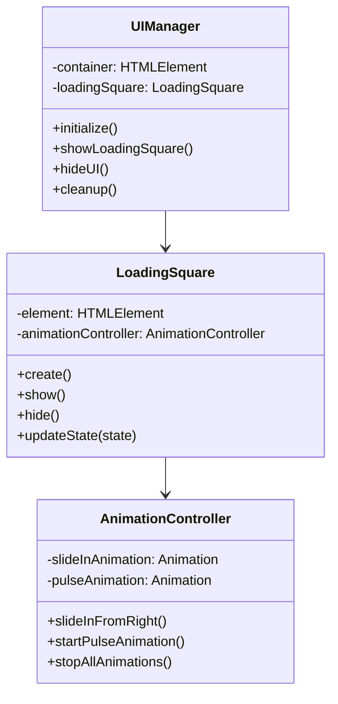

# Task 4.1: Loading Square UI Implementation Plan

## Overview
Implement the initial loading square that appears when a video is paused, providing visual feedback during screenshot processing. This square will serve as the foundation for the full product overlay system in subsequent tasks.

## Current State Analysis
- Video pause detection triggers [`captureScreenshot()`](../../extension/src/content/screenshot-capturer.ts:44)
- Background script handles the full analysis workflow in [`handleScreenshotAnalysis()`](../../extension/src/background/analysis-workflow.ts:20)
- No UI components currently exist - only console logging
- Content script manages video detection and screenshot triggering

## Implementation Architecture

```mermaid
graph TB
    A[Video Pause Detected] --> B[captureScreenshot() called]
    B --> C[Show Loading Square]
    C --> D[Slide Animation from Right]
    D --> E[Position at Top-Right Corner]
    E --> F[Pulsing Loading Animation]
    
    B --> G[Background Script Processing]
    G --> H[Screenshot Capture]
    H --> I[Server Analysis]
    I --> J[Amazon Search & Scraping]
    
    J --> K[Processing Complete Message]
    K --> L[Update UI State]
    
    M[Video Resume Detected] --> N[Hide & Cleanup UI]
    
    subgraph "UI Components"
        O[LoadingSquare Class]
        P[UIManager Class]
        Q[Animation Controller]
    end
    
    subgraph "Styling"
        R[CSS Animations]
        S[Responsive Positioning]
        T[Loading States]
    end
```

## Component Architecture



## File Structure Plan

```
extension/src/ui/
├── ui-manager.ts           # Main UI orchestrator
├── components/
│   ├── loading-square.ts   # Loading square component
│   └── animation-controller.ts  # Animation utilities
├── styles.css             # Complete UI styling
└── types.ts               # UI-specific type definitions
```

## Detailed Implementation Steps

### Step 1: Create UI Foundation
- **File**: [`extension/src/ui/ui-manager.ts`](../../extension/src/ui/ui-manager.ts)
  - Main UI orchestrator class
  - Handles container creation and DOM injection
  - Manages UI lifecycle and cleanup
  - Provides interface for content script communication

### Step 2: Implement Loading Square Component
- **File**: [`extension/src/ui/components/loading-square.ts`](../../extension/src/ui/components/loading-square.ts)
  - 120px × 120px semi-transparent black square
  - 12px border-radius for rounded corners
  - Configurable positioning and animation states
  - State management for different loading phases

### Step 3: Animation System
- **File**: [`extension/src/ui/components/animation-controller.ts`](../../extension/src/ui/components/animation-controller.ts)
  - Slide-in animation from right side of screen
  - Pulsing opacity animation for loading state
  - Smooth positioning to top-right corner with margins
  - Animation cleanup and performance optimization

### Step 4: Enhanced Styling
- **File**: [`extension/src/ui/styles.css`](../../extension/src/ui/styles.css)
  - Complete CSS animations and transitions
  - Responsive positioning calculations
  - Z-index management for overlay
  - Cross-platform compatibility

### Step 5: Content Script Integration
- **File**: [`extension/src/content/screenshot-capturer.ts`](../../extension/src/content/screenshot-capturer.ts)
  - Modify [`captureScreenshot()`](../../extension/src/content/screenshot-capturer.ts:44) to trigger UI
  - Add UI cleanup on video resume
  - Handle UI state updates based on processing progress

### Step 6: Video Detection Integration
- **File**: [`extension/src/content/video-detector.ts`](../../extension/src/content/video-detector.ts)
  - Modify [`handlePlay()`](../../extension/src/content/video-detector.ts:65) to cleanup UI
  - Ensure UI is properly removed when video resumes
  - Handle edge cases like rapid pause/resume cycles

## Technical Specifications

### Loading Square Styling
```css
.pauseshop-loading-square {
    width: 120px;
    height: 120px;
    background: rgba(0, 0, 0, 0.7);
    border-radius: 12px;
    position: fixed;
    top: 20px;
    right: 20px;
    z-index: 999999;
    transform: translateX(160px); /* Start off-screen */
    transition: transform 0.3s ease-out;
}
```

### Animation Specifications
- **Slide-in**: 300ms ease-out transition from `translateX(160px)` to `translateX(0)`
- **Pulse Animation**: 1.5s infinite ease-in-out opacity between 0.7 and 1.0
- **Positioning**: 20px margin from top and right edges

### State Management
```typescript
enum LoadingState {
    HIDDEN = 'hidden',
    SLIDING_IN = 'sliding-in',
    LOADING = 'loading',
    PROCESSING = 'processing',
    SLIDING_OUT = 'sliding-out'
}
```

## Integration Points

### Content Script Flow
1. **Trigger**: [`video-detector.ts:55`](../../extension/src/content/video-detector.ts:55) calls [`captureScreenshot()`](../../extension/src/content/screenshot-capturer.ts:44)
2. **UI Show**: Immediately display loading square with slide-in animation
3. **State Updates**: Update UI based on background script messages
4. **Cleanup**: Remove UI when [`handlePlay()`](../../extension/src/content/video-detector.ts:65) is triggered

### Background Script Communication
- Extend [`ScreenshotResponse`](../../extension/src/content/screenshot-capturer.ts:19) interface for UI state updates
- Add progress messaging for different workflow stages
- Handle error states with appropriate UI feedback

## Performance Considerations

- **DOM Injection**: Minimal DOM footprint with single container
- **Animation Performance**: Use CSS transforms and opacity for GPU acceleration
- **Memory Management**: Proper cleanup of event listeners and animations
- **Z-index Management**: High z-index (999999) to ensure overlay visibility

## Error Handling

- **Animation Failures**: Fallback to instant show/hide if animations fail
- **DOM Access**: Defensive programming for different page environments
- **Resource Cleanup**: Guaranteed cleanup even in error scenarios

## Testing Strategy

- **Manual Testing**: Verify on Netflix, Hulu, and other streaming platforms
- **Animation Smoothness**: Test slide-in timing and visual smoothness
- **Responsive Behavior**: Test on different screen sizes and zoom levels
- **Edge Cases**: Rapid pause/resume, multiple videos, page navigation

## Implementation Priority

1. **High Priority**: UI Manager and Loading Square core functionality
2. **Medium Priority**: Animation system and smooth transitions
3. **Low Priority**: Advanced state management and error handling optimizations

## Success Criteria

- ✅ Loading square appears immediately when video is paused
- ✅ Smooth slide-in animation from right side of screen
- ✅ Proper positioning at top-right corner with margins
- ✅ Pulsing animation indicates processing state
- ✅ UI disappears when video resumes
- ✅ No interference with video player functionality
- ✅ Cross-platform compatibility (Netflix, Hulu, etc.)

This plan provides a solid foundation for the loading square implementation while setting up the architecture for subsequent tasks in Phase 4. The modular design ensures scalability for the full product overlay system that will follow.