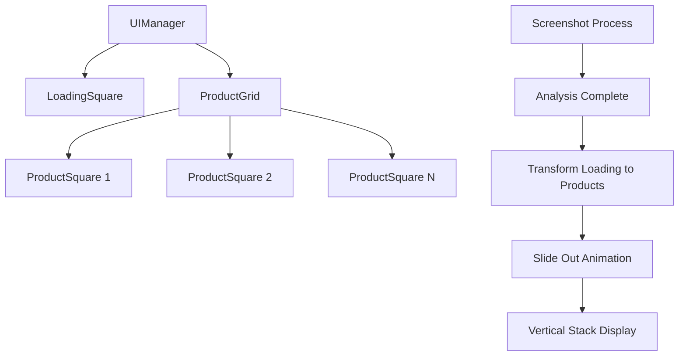

# Task 4.2 Implementation Plan: Product Square Duplication and Vertical Stacking

## Overview
Transform the single loading square into a vertical stack of N product squares, where N-1 new squares slide "out under" the original square to their positions below.

## Current State Analysis
- ✅ Single loading square slides in from right and shows loading animation
- ✅ Screenshot capture and analysis workflow complete  
- ✅ Amazon search results available in `response.amazonSearchResults`
- ✅ Product data available in `response.analysisResult.products`

## Architecture Plan



## Implementation Components

### 1. ProductSquare Component (`extension/src/ui/components/product-square.ts`)
- **Purpose**: Individual product square with thumbnail display
- **Features**:
  - Same visual styling as loading square (126px, rounded corners)
  - Product thumbnail image display
  - Hover effects and click handling (for future tasks)
  - Animation support for sliding movements

### 2. ProductGrid Component (`extension/src/ui/components/product-grid.ts`)
- **Purpose**: Manages vertical stack of product squares
- **Features**:
  - Calculate positions for N squares with proper spacing
  - Handle staggered slide-out animations
  - Manage square lifecycle and cleanup
  - Responsive positioning based on screen size

### 3. Enhanced UIManager (`extension/src/ui/ui-manager.ts`)
- **New Methods**:
  - `showProductGrid(products: Product[])` - Transition from loading to products
  - `hideProductGrid()` - Hide all product squares
  - `isProductGridVisible()` - Check if products are displayed

### 4. Enhanced Types (`extension/src/ui/types.ts`)
- **New Enums**:
  - `ProductDisplayState` (HIDDEN, SLIDING_OUT, DISPLAYED)
- **New Interfaces**:
  - `ProductSquareConfig` - Configuration for product squares
  - `ProductGridConfig` - Grid layout configuration
  - `ProductDisplayData` - Product data for UI display

## Detailed Implementation Steps

### Step 1: Create ProductSquare Component
```typescript
interface ProductSquareConfig {
    size: number;
    borderRadius: number;
    position: { top: number; right: number };
    thumbnailUrl: string;
    productData: AmazonScrapedProduct;
}

class ProductSquare {
    // Visual styling matching loading square
    // Thumbnail image display
    // Animation support for sliding
    // Click handling (placeholder for future)
}
```

### Step 2: Create ProductGrid Component  
```typescript
interface ProductGridConfig {
    squareSize: number;
    spacing: number; // Gap between squares
    startPosition: { top: number; right: number };
    animationDelayMs: number; // Stagger animation timing
}

class ProductGrid {
    // Calculate positions for N squares
    // Create and manage ProductSquare instances
    // Handle staggered slide-out animations
    // Cleanup and memory management
}
```

### Step 3: Animation Sequence Design
1. **Initial State**: Single loading square visible at top-right
2. **Trigger**: Analysis complete with N products found
3. **Animation**: 
   - Original square transforms to first product square
   - N-1 new squares appear at same position
   - New squares slide down sequentially with 100ms stagger
   - Final spacing: 140px between square centers (126px + 14px gap)

### Step 4: Data Integration
- Extract product thumbnails from `response.amazonSearchResults`
- Use first product thumbnail for each detected product category
- Handle cases where thumbnails are missing (placeholder image)
- Maintain mapping between UI squares and product data

### Step 5: Enhanced Screenshot Capturer Integration
```typescript
// In screenshot-capturer.ts
if (response.success && response.amazonSearchResults) {
    const { scrapedResults } = response.amazonSearchResults;
    
    // Extract thumbnails for UI display
    const productDisplayData = scrapedResults.map(result => ({
        thumbnailUrl: result.products[0]?.thumbnailUrl,
        productData: result.products[0],
        category: result.originalSearchResult.category
    }));
    
    // Show product grid instead of keeping loading square
    if (ui) {
        await ui.showProductGrid(productDisplayData);
    }
}
```

## Visual Specifications

### Square Layout
- **Size**: 126px x 126px (matching loading square)
- **Spacing**: 14px gap between squares
- **Position**: Right-aligned with 30px margin from screen edge
- **Animation**: 200ms slide duration with 100ms stagger between squares

### Thumbnail Display
- **Image Size**: 100px x 100px (centered in 126px square)
- **Border Radius**: 8px for thumbnails
- **Fallback**: Gradient background if thumbnail missing
- **Loading**: Subtle pulse while thumbnail loads

## Error Handling

### Missing Thumbnails
- Display gradient background with product category icon
- Log warning but continue with grid display
- Maintain consistent square sizing

### Animation Failures
- Fallback to instant positioning
- Ensure all squares are visible even if animations fail
- Log errors for debugging

## Testing Strategy

### Manual Testing Points
1. **Single Product**: Verify one square transforms correctly
2. **Multiple Products**: Test 2-5 products with proper stacking
3. **Missing Thumbnails**: Verify fallback display works
4. **Animation Timing**: Check stagger effect and smooth movement
5. **Cleanup**: Ensure squares disappear when video resumes

### Browser Compatibility
- Test on Chrome (primary target)
- Verify on different screen sizes
- Check performance with multiple animations

## Future Integration Points

### Task 4.3 Preparation
- ProductSquare already includes thumbnail display
- Product data mapping ready for click handling

### Task 4.4 Preparation  
- ProductSquare includes product data for expansion
- Grid positioning accounts for horizontal expansion space

## Implementation Files

### New Files to Create
1. [`extension/src/ui/components/product-square.ts`](extension/src/ui/components/product-square.ts) - Individual product square component
2. [`extension/src/ui/components/product-grid.ts`](extension/src/ui/components/product-grid.ts) - Grid management component

### Files to Modify
1. [`extension/src/ui/types.ts`](extension/src/ui/types.ts) - Add new interfaces and enums
2. [`extension/src/ui/ui-manager.ts`](extension/src/ui/ui-manager.ts) - Add product grid methods
3. [`extension/src/content/screenshot-capturer.ts`](extension/src/content/screenshot-capturer.ts) - Integration with product display

## Success Criteria
- ✅ Single loading square transforms into N product squares
- ✅ Squares slide out with staggered animation timing
- ✅ Product thumbnails display correctly in squares
- ✅ Fallback handling for missing thumbnails
- ✅ Clean animation and positioning
- ✅ Proper cleanup when video resumes