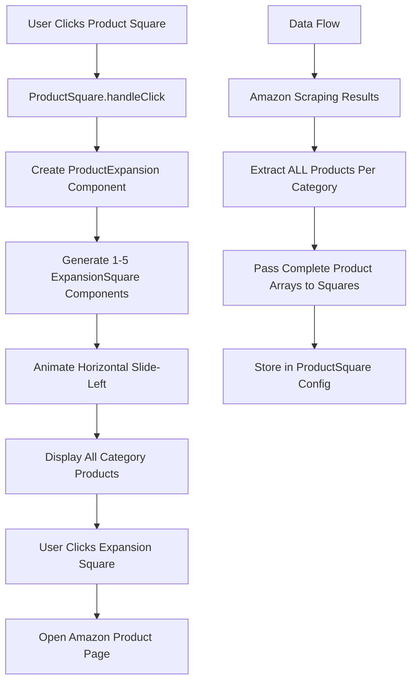
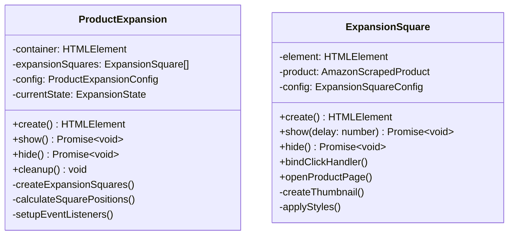

# Task 4.4 Implementation Plan: Horizontal Product Expansion

## Overview
Implement horizontal expansion functionality when users click on product squares. When clicked, a product square should expand leftward, displaying 1-5 smaller squares showing all products found for that category. Clicking on any expansion square should open the corresponding Amazon product page.

## Current State Analysis

✅ **Completed (Tasks 4.1-4.3):**
- Loading square slides in from right with gradient animation
- Square duplication into vertical stack (N squares for N product categories)
- Thumbnail display with robust fallback system

🔄 **Current Limitation:**
- Each [`ProductSquare`](extension/src/ui/components/product-square.ts:1) only has access to one product (first from category)
- [`ProductDisplayData`](extension/src/ui/types.ts:57) interface only contains single product reference
- No click handling or expansion functionality

## Implementation Architecture



## Phase 1: Data Structure Enhancement

### 1.1 Update Type Definitions
**File:** [`extension/src/ui/types.ts`](extension/src/ui/types.ts:1)

```typescript
// Enhanced ProductDisplayData to include all products
export interface ProductDisplayData {
    thumbnailUrl: string | null;
    allProducts: AmazonScrapedProduct[]; // NEW: All 1-5 products for category
    category: ProductCategory;
    fallbackText?: string;
}

// New interface for expansion component
export interface ProductExpansionConfig {
    parentSquare: HTMLElement;
    products: AmazonScrapedProduct[];
    category: ProductCategory;
    startPosition: { top: number; right: number };
    expansionDirection: 'left';
    squareSize: number;
    spacing: number;
    animations: {
        slideLeftDuration: number;
        fadeInDuration: number;
    };
}

// New state for expanded squares
export enum ExpansionState {
    HIDDEN = 'hidden',
    EXPANDING = 'expanding', 
    EXPANDED = 'expanded',
    COLLAPSING = 'collapsing'
}

// Configuration for individual expansion squares
export interface ExpansionSquareConfig {
    product: AmazonScrapedProduct;
    position: { top: number; right: number };
    size: number;
    borderRadius: number;
    backgroundColor: string;
    index: number;
    animations: {
        slideLeftDuration: number;
        thumbnailFadeDuration: number;
    };
}
```

### 1.2 Update ProductSquareConfig
```typescript
export interface ProductSquareConfig {
    // ... existing fields
    allProducts: AmazonScrapedProduct[]; // NEW: Complete product array
    onExpansionRequest?: (products: AmazonScrapedProduct[], category: ProductCategory) => void;
}
```

## Phase 2: Data Flow Modification

### 2.1 Update Data Extraction Logic
**File:** [`extension/src/ui/ui-manager.ts`](extension/src/ui/ui-manager.ts:1)

```typescript
// Enhanced data extraction to include all products
private extractProductDisplayData(amazonResults: AmazonScrapedBatch): ProductDisplayData[] {
    return amazonResults.scrapedResults.map(result => {
        if (result.success && result.products.length > 0) {
            return {
                thumbnailUrl: result.products[0]?.thumbnailUrl || null,
                allProducts: result.products, // Pass ALL products
                category: result.searchQuery.category,
                fallbackText: result.searchQuery.originalQuery
            };
        }
        // Handle failed searches...
    });
}
```

### 2.2 Update ProductGrid Configuration
```typescript
// In ProductGrid.createProductSquares()
const squareConfig: ProductSquareConfig = {
    size: this.config.squareSize,
    borderRadius: this.config.borderRadius,
    backgroundColor: this.config.backgroundColor,
    position: this.calculateSquarePosition(index),
    thumbnailUrl: data.thumbnailUrl,
    productData: data.allProducts[0], // First product for thumbnail
    allProducts: data.allProducts,    // ALL products for expansion
    category: data.category,
    animations: {
        slideDownDuration: 200,
        thumbnailFadeDuration: 300
    }
};
```

## Phase 3: Product Expansion Component

### 3.1 Create ProductExpansion Component
**New File:** `extension/src/ui/components/product-expansion.ts`



### 3.2 ProductExpansion Implementation Structure
```typescript
export class ProductExpansion {
    private container: HTMLElement | null = null;
    private expansionSquares: ExpansionSquare[] = [];
    private config: ProductExpansionConfig;
    private currentState: ExpansionState = ExpansionState.HIDDEN;

    public async create(): Promise<HTMLElement> {
        // Create container for expansion squares
        // Position relative to parent square
        // Create 1-5 ExpansionSquare instances
    }

    public async show(): Promise<void> {
        // Animate expansion squares sliding left with stagger
        // 50ms delay between each square
        // 200ms slide duration per square
    }

    public async hide(): Promise<void> {
        // Reverse animation - slide back to right
        // Remove from DOM after animation
    }

    private createExpansionSquares(): void {
        // Create ExpansionSquare for each product (skipping first one)
        // Calculate positions for horizontal layout
        // Set up click handlers for Amazon links
    }
}
```

### 3.3 ExpansionSquare Implementation
```typescript
export class ExpansionSquare {
    private element: HTMLElement | null = null;
    private product: AmazonScrapedProduct;
    private config: ExpansionSquareConfig;
    private thumbnailElement: HTMLImageElement | null = null;

    public create(): HTMLElement {
        // Create 85px x 85px squares (smaller than main 126px squares)
        // Same gradient background and styling as main squares
        // Include thumbnail with fallback handling
        // Bind click handler for Amazon product page
    }

    private bindClickHandler(): void {
        this.element?.addEventListener('click', (e) => {
            e.stopPropagation(); // Prevent parent square click
            this.openProductPage();
        });
    }

    private openProductPage(): void {
        if (this.product.productUrl) {
            window.open(this.product.productUrl, '_blank');
        }
    }

    private createThumbnail(): void {
        // Same thumbnail logic as ProductSquare but 67px x 67px
        // Same fallback system with category icons
    }
}
```

## Phase 4: Animation Enhancement

### 4.1 Extend AnimationController
**File:** [`extension/src/ui/components/animation-controller.ts`](extension/src/ui/components/animation-controller.ts:1)

```typescript
// Add horizontal expansion animations
public async slideLeft(config: AnimationConfig & { distance: number }): Promise<void> {
    return this.animate([
        { transform: 'translateX(0)', opacity: '0' },
        { transform: `translateX(-${config.distance}px)`, opacity: '1' }
    ], {
        duration: config.duration,
        easing: config.easing,
        fill: 'forwards'
    });
}

public async slideRight(config: AnimationConfig & { distance: number }): Promise<void> {
    return this.animate([
        { transform: `translateX(-${config.distance}px)`, opacity: '1' },
        { transform: 'translateX(0)', opacity: '0' }
    ], {
        duration: config.duration,
        easing: config.easing,
        fill: 'forwards'
    });
}

public async expandHorizontally(elements: HTMLElement[], spacing: number): Promise<void> {
    // Staggered slide-left animations for multiple squares
    const promises = elements.map((element, index) => {
        const delay = index * 50; // 50ms stagger
        const distance = (index + 1) * (85 + spacing); // 85px = expansion square size
        
        return new Promise<void>((resolve) => {
            setTimeout(async () => {
                await this.animateElement(element, [
                    { transform: 'translateX(0) scale(0.8)', opacity: '0' },
                    { transform: `translateX(-${distance}px) scale(1)`, opacity: '1' }
                ], { duration: 200, easing: 'ease-out' });
                resolve();
            }, delay);
        });
    });
    
    await Promise.all(promises);
}
```

## Phase 5: Click Handling Integration

### 5.1 Update ProductSquare with Click Handling
**File:** [`extension/src/ui/components/product-square.ts`](extension/src/ui/components/product-square.ts:1)

```typescript
export class ProductSquare {
    private expansion: ProductExpansion | null = null;
    private isExpanded: boolean = false;

    public create(): HTMLElement {
        // ... existing creation logic
        
        // Add click handler only if multiple products available
        if (this.config.allProducts.length > 1) {
            this.element.addEventListener('click', this.handleClick.bind(this));
            this.element.style.cursor = 'pointer';
        }
        
        return this.element;
    }

    private async handleClick(event: Event): Promise<void> {
        event.preventDefault();
        event.stopPropagation();
        
        if (this.isExpanded) {
            await this.collapseExpansion();
        } else {
            await this.expandHorizontally();
        }
    }

    private async expandHorizontally(): Promise<void> {
        if (this.config.allProducts.length <= 1) {
            return; // No additional products to show
        }

        // Notify parent grid to collapse other expansions
        await this.notifyExpansionRequest();

        // Create expansion component
        const expansionConfig: ProductExpansionConfig = {
            parentSquare: this.element!,
            products: this.config.allProducts.slice(1), // Skip first product (already shown)
            category: this.config.category,
            startPosition: this.config.position,
            expansionDirection: 'left',
            squareSize: 85, // Smaller than main square
            spacing: 12,
            animations: {
                slideLeftDuration: 200,
                fadeInDuration: 300
            }
        };

        this.expansion = new ProductExpansion(expansionConfig);
        const expansionElement = await this.expansion.create();
        
        // Add to same container as product squares
        if (this.element?.parentElement) {
            this.element.parentElement.appendChild(expansionElement);
        }
        
        await this.expansion.show();
        this.isExpanded = true;
    }

    public async collapseExpansion(): Promise<void> {
        if (!this.expansion || !this.isExpanded) {
            return;
        }

        await this.expansion.hide();
        this.expansion.cleanup();
        this.expansion = null;
        this.isExpanded = false;
    }

    public getIsExpanded(): boolean {
        return this.isExpanded;
    }
}
```

## Phase 6: State Management Enhancement

### 6.1 Update ProductGrid for Expansion Management
**File:** [`extension/src/ui/components/product-grid.ts`](extension/src/ui/components/product-grid.ts:1)

```typescript
export class ProductGrid {
    private expandedSquareIndex: number | null = null;

    private createProductSquares(productData: ProductDisplayData[]): void {
        productData.forEach((data, index) => {
            const squareConfig: ProductSquareConfig = {
                // ... existing config
                allProducts: data.allProducts, // Pass all products
                onExpansionRequest: () => this.handleExpansionRequest(index)
            };

            const square = new ProductSquare(squareConfig);
            // ... rest of creation logic
        });
    }

    private async handleExpansionRequest(requestingIndex: number): Promise<void> {
        // Collapse any currently expanded square
        if (this.expandedSquareIndex !== null && this.expandedSquareIndex !== requestingIndex) {
            const currentlyExpanded = this.productSquares[this.expandedSquareIndex];
            await currentlyExpanded.collapseExpansion();
        }
        
        this.expandedSquareIndex = requestingIndex;
    }

    public async collapseAllExpansions(): Promise<void> {
        if (this.expandedSquareIndex !== null) {
            const square = this.productSquares[this.expandedSquareIndex];
            await square.collapseExpansion();
            this.expandedSquareIndex = null;
        }
    }

    public async hide(): Promise<void> {
        // Collapse all expansions before hiding
        await this.collapseAllExpansions();
        
        // ... existing hide logic
    }
}
```

### 6.2 Update UIManager Integration
**File:** [`extension/src/ui/ui-manager.ts`](extension/src/ui/ui-manager.ts:1)

```typescript
public async hideUI(): Promise<void> {
    // Ensure all expansions are collapsed before hiding
    if (this.productGrid) {
        await this.productGrid.collapseAllExpansions();
    }
    
    await Promise.all([
        this.hideLoadingSquare(),
        this.hideProductGrid()
    ]);
}
```

## Implementation Sequence

```mermaid
gantt
    title Task 4.4 Implementation Timeline
    dateFormat X
    axisFormat %d

    section Phase 1: Data Structure
    Update Types           :a1, 0, 1d
    Modify Data Flow       :a2, after a1, 1d

    section Phase 2: Components
    ProductExpansion       :b1, after a2, 2d
    ExpansionSquare        :b2, after b1, 1d

    section Phase 3: Animation
    Extend AnimController  :c1, after b2, 1d
    Test Animations        :c2, after c1, 1d

    section Phase 4: Integration
    Update ProductSquare   :d1, after c2, 1d
    Update ProductGrid     :d2, after d1, 1d

    section Phase 5: Testing
    Manual Testing         :e1, after d2, 2d
    Bug Fixes             :e2, after e1, 1d
```



## Visual Specifications

Based on the provided image:

- **Main Square**: 126px × 126px (current size)
- **Expansion Squares**: 85px × 85px (smaller, approximately 67% of main square)
- **Expansion Thumbnails**: 67px × 67px (maintaining 13px margin)
- **Horizontal Spacing**: 12px between expansion squares
- **Animation Duration**: 200ms slide-left with 50ms stagger
- **Animation Easing**: `ease-out` for natural feel
- **Z-Index Management**: 
  - Main squares: 999999
  - Expansion squares: 999998
  - Expansion container: 999997

## User Experience Flow

1. **Initial State**: Vertical stack of product squares visible
2. **User Clicks Square**: Square with multiple products expands horizontally
3. **Expansion Animation**: 1-4 additional squares slide left from main square
4. **Product Display**: Each expansion square shows product thumbnail
5. **Click to Purchase**: User clicks expansion square → Amazon page opens
6. **State Management**: Only one expansion active at a time
7. **Auto-Collapse**: Expansion collapses when video resumes or user clicks elsewhere

## Success Criteria

1. ✅ **Click Detection**: Product squares respond to click events
2. ✅ **Horizontal Expansion**: 1-5 smaller squares slide left from main square
3. ✅ **Product Display**: Each expansion square shows correct product thumbnail
4. ✅ **Amazon Integration**: Clicking expansion squares opens correct product pages
5. ✅ **State Management**: Only one expansion active at a time
6. ✅ **Animation Quality**: Smooth 200ms animations with 50ms staggered timing
7. ✅ **Responsive Cleanup**: Expansions collapse when video resumes
8. ✅ **Fallback Handling**: Expansion squares handle missing thumbnails gracefully
9. ✅ **Performance**: No memory leaks or DOM pollution from expansions

## Technical Considerations

### Error Handling
- Graceful fallback when product URLs are invalid
- Robust thumbnail loading with fallback system
- Animation error recovery with instant positioning

### Performance
- Efficient DOM management (create/destroy expansion elements)
- Minimal memory footprint for expansion components
- Smooth animations that don't block main thread

### Accessibility
- Keyboard navigation support for expansion squares
- Screen reader friendly product descriptions
- Focus management during expansion/collapse

### Browser Compatibility
- CSS animations with vendor prefixes if needed
- Modern browser API usage (Chrome extension context)
- Consistent behavior across different video platforms

This plan provides a comprehensive roadmap for implementing the horizontal expansion functionality while maintaining the existing codebase architecture and animation quality established in previous tasks.