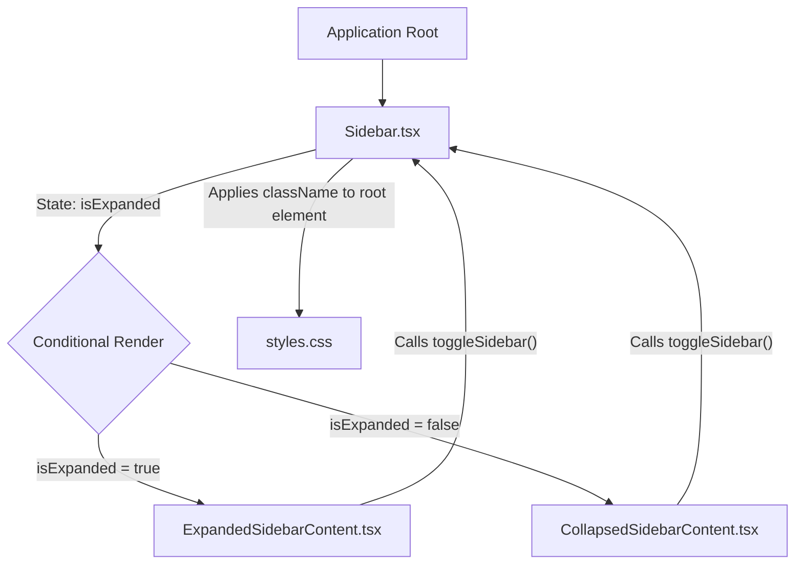

# Architectural Plan for Dynamic Sidebar Content

**Goal:** Implement a sidebar that dynamically renders completely different content components based on its expanded or collapsed state.

**Key Components Involved:**
*   [`Sidebar.tsx`](extension/src/ui/components/Sidebar.tsx): The main container component for the sidebar, responsible for managing the `isExpanded` state and orchestrating which content component to render.
*   `ExpandedSidebarContent.tsx` (New): A new component that will encapsulate all UI elements specific to the expanded state of the sidebar.
*   `CollapsedSidebarContent.tsx` (New): A new component that will encapsulate all UI elements specific to the collapsed state of the sidebar.
*   [`SidebarContent.tsx`](extension/src/ui/components/SidebarContent.tsx): This component currently seems to hold the main content. It will be refactored or its responsibilities will be split into the two new dedicated components mentioned above.

**Proposed Steps:**

1.  **Introduce State for Sidebar Expansion:**
    *   In [`Sidebar.tsx`](extension/src/ui/components/Sidebar.tsx), maintain a boolean state variable, e.g., `isExpanded`, to control the sidebar's current state (expanded/collapsed).
    *   Add a function to toggle this state, which can be triggered by a button or other UI element within the sidebar (e.g., a collapse/expand button).

2.  **Create New Content Components:**
    *   **`ExpandedSidebarContent.tsx`**: Create this new React component. It will contain all the specific components, navigation items, and UI elements that should only appear when the sidebar is in its expanded state.
    *   **`CollapsedSidebarContent.tsx`**: Create this new React component. It will contain the condensed UI elements, typically icons or a minimalist representation, that should only appear when the sidebar is in its collapsed state.
    *   If [`SidebarContent.tsx`](extension/src/ui/components/SidebarContent.tsx) contains elements common to both states (though the user indicated they are "very different"), these common elements should either be promoted to `Sidebar.tsx` or duplicated appropriately within the new components. However, given the user's explicit desire for "very different components," it's likely [`SidebarContent.tsx`](extension/src/ui/components/SidebarContent.tsx) will be deprecated or completely refactored into the new components.

3.  **Implement Conditional Rendering in `Sidebar.tsx`:**
    *   [`Sidebar.tsx`](extension/src/ui/components/Sidebar.tsx) will use conditional logic (e.g., a ternary operator) based on the `isExpanded` state to render either `ExpandedSidebarContent` or `CollapsedSidebarContent`.

    ```typescript
    // Conceptual example within Sidebar.tsx's render function
    {isExpanded ? (
      <ExpandedSidebarContent onToggle={toggleSidebar} />
    ) : (
      <CollapsedSidebarContent onToggle={toggleSidebar} />
    )}
    ```

4.  **Manage Interaction and State Flow:**
    *   The `toggleSidebar` function (or a similar handler) from `Sidebar.tsx` should be passed as a prop to both `ExpandedSidebarContent` and `CollapsedSidebarContent`. This allows buttons or interactions within these content components to trigger the state change in the parent `Sidebar.tsx`, thus switching the displayed content.

5.  **Refine Styling:**
    *   Update [`extension/src/ui/styles.css`](extension/src/ui/styles.css) (or create new CSS modules/files) to handle the visual transitions and layout differences between the expanded and collapsed states. This would typically involve different `width` properties for the main sidebar wrapper and potentially `overflow: hidden` for the collapsed state to hide additional text/elements.
    *   Individual styles for components within `ExpandedSidebarContent.tsx` and `CollapsedSidebarContent.tsx` will be defined directly within or alongside those respective components.

**Component Interaction Flow:**



**Benefits of this approach:**

*   **Clear Separation of Concerns:** Each content component is responsible only for its specific state's UI.
*   **Improved Maintainability:** Changes to the expanded view don't directly impact the collapsed view, and vice-versa.
*   **Enhanced Readability:** The code for each state is isolated and easier to understand.
*   **Optimized Performance:** Only the necessary components for the current state are rendered.